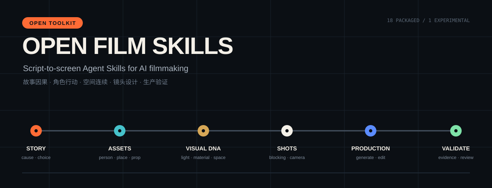
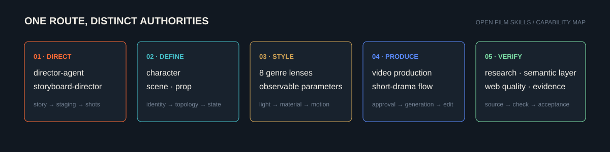

<div align="center">



# Open Film Skills

**Reusable directing intelligence for AI-native filmmaking.**

[简体中文](docs/i18n/zh-CN/README.md) · [日本語](docs/i18n/ja/README.md) · [한국어](docs/i18n/ko/README.md) · **English**


[](LICENSE)
[](https://github.com/62656456/ai-film-skills/actions/workflows/validate.yml)

</div>

## Start here

| I want to… | Start with |
|---|---|
| Write, revise, or diagnose a script | [`director-agent`](skills/director-agent/) |
| Turn an approved script into readable shots and generation prompts | [`ai-storyboard-director`](skills/ai-storyboard-director/) |
| Define reusable character, scene, or prop references | [`character-asset`](skills/character-asset/) · [`scene-asset`](skills/scene-asset/) · [`prop-asset`](skills/prop-asset/) |
| Add an observable genre-specific visual language | [Genre design Skills](#skill-map) |
| Produce an approved passage as AI video | [`produce-ai-video`](skills/produce-ai-video/) |
| Plan an end-to-end short-drama workflow | [`ai-short-drama-production`](skills/ai-short-drama-production/) |
| Design or audit a distinctive web interface | [`web-design-director`](skills/web-design-director/) |

## The promise

These Skills do not replace judgment with prompt decoration. They turn story causality, character purpose, blocking, spatial continuity, physical action, light, materials, and production gates into reusable operating contracts.

The visible result comes first: a readable script, shot plan, asset contract, visual direction, research report, or qualified media deliverable. Internal schemas and checks support that result; they do not replace it.



## Quick install

Clone the repository:

```bash
git clone https://github.com/62656456/ai-film-skills.git
cd ai-film-skills
```

Install all packaged Skills into Codex on macOS or Linux:

```bash
mkdir -p ~/.codex/skills
cp -R skills/* ~/.codex/skills/
```

Install all packaged Skills on Windows PowerShell:

```powershell
New-Item -ItemType Directory -Force "$env:USERPROFILE\.codex\skills" | Out-Null
Copy-Item -Recurse -Force .\skills\* "$env:USERPROFILE\.codex\skills\"
```

To install one Skill, copy its directory and the shared `skills/references` directory. Experimental Skills are never installed by the commands above.

## Skill map

| Layer | Skills | Status |
|---|---|---|
| Story and directing | `director-agent`, `ai-storyboard-director` | Deployed |
| Asset definition | `character-asset`, `scene-asset`, `prop-asset` | Deployed |
| Visual language | `cyberpunk-design`, `epic-design`, `fantasy-design`, `horror-design`, `noir-design`, `romance-design`, `war-design`, `wuxia-design` | Deployed |
| Production | `produce-ai-video` | Deployed |
| Workflow orchestration | `ai-short-drama-production` | Packaged; validation pending |
| Product and research | `web-design-director`, `d-official-market-analysis`, `d-data-analysis-semantic-layer` | Deployed |
| Experimental | `hard-sci-fi-visual-director` | Not deployed; user visual review pending |

See the detailed [Skill catalog](SKILL_CATALOG.md) and [architecture](docs/ARCHITECTURE.md).

## Status means something

- **Deployed**: the current personal runtime package is in use. It is not automatically described as stable in practice.
- **Packaged**: structurally complete enough to distribute, but not currently deployed.
- **Experimental**: isolated from normal installation and clearly marked as unapproved or incomplete.
- **Retired**: intentionally absent. A retired package is not restored from an old file.
- **Third-party**: not republished as original work.

## Repository design

The repository is organized as a production map rather than a wall of prompts. The visual system uses film-slate black, script-paper white, signal orange, cool cyan, and brass. One horizontal route—**story → assets → visual language → shots → production → validation**—acts as the signature element across the README and diagrams.

The information architecture was informed by [OmniRoute](https://github.com/diegosouzapw/OmniRoute): a strong visual thesis, immediate navigation, visible status, multilingual entry points, copyable quick starts, diagrams, contribution routes, security guidance, and explicit third-party notices. No OmniRoute brand asset, illustration, copy, or code is included here.

## Contributing and safety

- Read [CONTRIBUTING.md](CONTRIBUTING.md) before proposing a Skill change.
- Report accidental secrets or private information through [SECURITY.md](SECURITY.md), not a public issue.
- See [THIRD_PARTY_NOTICES.md](THIRD_PARTY_NOTICES.md) for excluded and adapted material.
- Check the exact public boundary in [PUBLICATION_SCOPE.md](PUBLICATION_SCOPE.md).
- Run `python scripts/validate_repository.py` before submitting changes.

## License

Personally authored content in this repository is licensed under the [Apache License 2.0](LICENSE), unless a file says otherwise.
