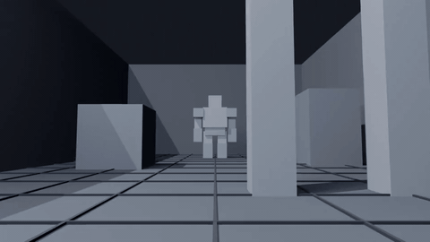
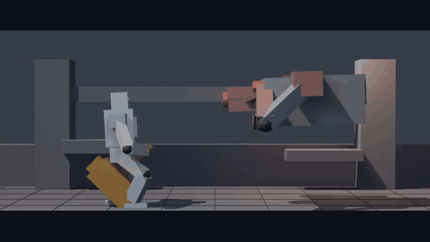
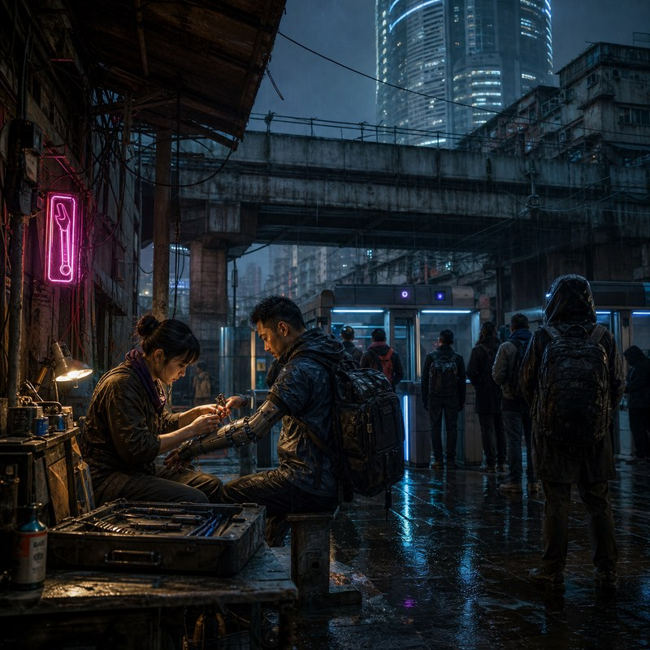
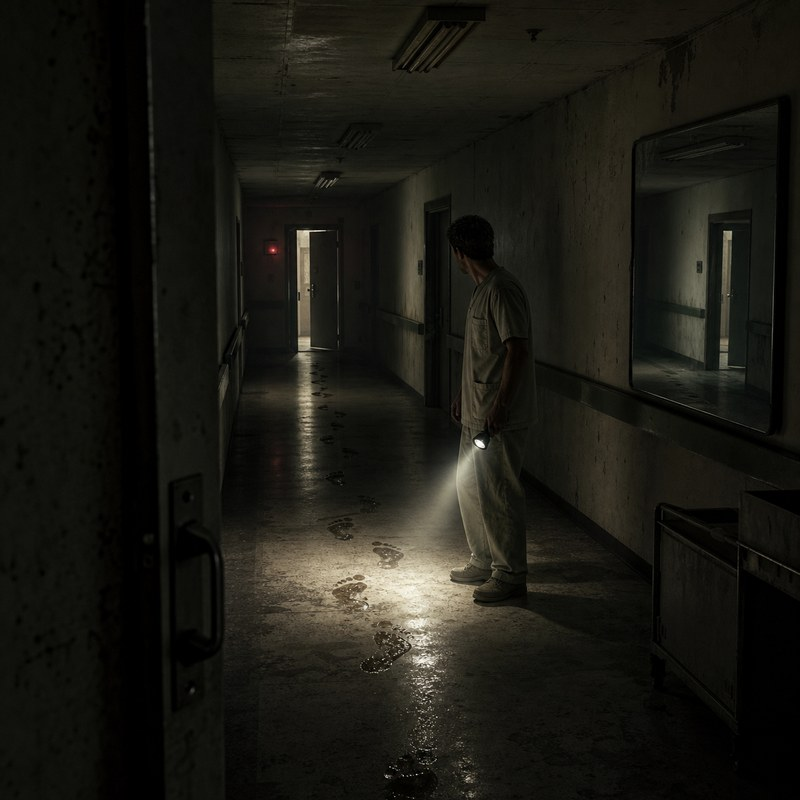
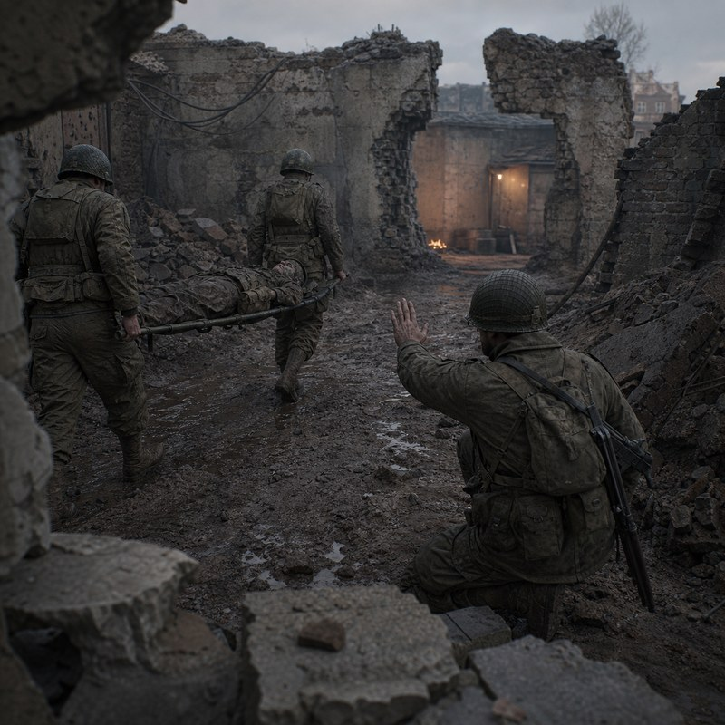
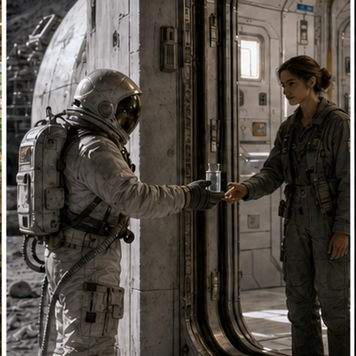
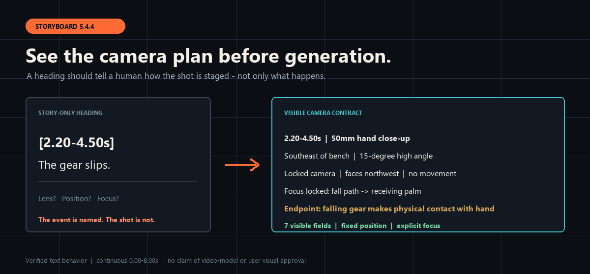

<div align="center">


# Open Film Skills

**Turn a script into cinematic storyboards, reusable visual assets, copy-ready prompts, and an AI-video production workflow—inside the Agent you already use.**

[简体中文](docs/i18n/zh-CN/README.md) · [日本語](docs/i18n/ja/README.md) · [한국어](docs/i18n/ko/README.md) · **English**


[](LICENSE)
[](https://github.com/62656456/ai-film-skills/actions/workflows/validate.yml)
[](https://skills.sh/62656456/ai-film-skills)
[](https://62656456.github.io/ai-film-skills/)

</div>

Open Film Skills is a public toolkit of 19 standalone Agent Skills for AI filmmaking: 18 stable modules and one isolated experiment. Start with one outcome; install the complete studio only when you need the full route.

## See the Skills in motion

<table>
<tr>
<td width="50%" valign="top">
<a href="https://62656456.github.io/ai-film-skills/media/previs-blocking-5s.mp4"></a><br />
<strong>Camera and blocking previs · 5.0 seconds</strong><br />
Makes camera movement, performer position, the cut, and scene parallax visible before generation. <a href="https://62656456.github.io/ai-film-skills/media/previs-blocking-5s.mp4">Play the original MP4</a>.
</td>
<td width="50%" valign="top">
<a href="https://62656456.github.io/ai-film-skills/media/rigged-contact-gate-2.8s.mp4"></a><br />
<strong>Rigged contact action gate · 2.8 seconds</strong><br />
Makes two-hand grip, final-surface contact, the held impact interval, and opposite recoil inspectable. <a href="https://62656456.github.io/ai-film-skills/media/rigged-contact-gate-2.8s.mp4">Play the original MP4</a>.
</td>
</tr>
</table>

These original local outputs show the kind of observable camera, blocking, and physical-action checkpoints the Skills are designed to specify and review. They are rough 3D previs—not finished AI films, external-user adoption, or proof that the unpublished local previs executor ships in this repository. [Open the complete media gallery](https://62656456.github.io/ai-film-skills/#media) · [Inspect hashes and evidence boundaries](docs/media/media-manifest.json)

## Explore the visual language

One internally reviewed image makes each genre Skill's observable design priorities visible. The image is an example of the parameters the linked Skill supplies—not a claim that the Skill alone generated it or that a user has accepted the aesthetic result.

<table>
<tr>
<td width="33%" valign="top"><a href="docs/skills/en/cyberpunk-design.md"></a><br /><strong><a href="docs/skills/en/cyberpunk-design.md">Cyberpunk</a></strong><br />Functional neon, unequal infrastructure, wet material response and repair labor.</td>
<td width="33%" valign="top"><a href="docs/skills/en/epic-design.md"></a><br /><strong><a href="docs/skills/en/epic-design.md">Epic</a></strong><br />Human-small scale, purposeful movement, material history and a readable destination.</td>
<td width="33%" valign="top"><a href="docs/skills/en/fantasy-design.md"></a><br /><strong><a href="docs/skills/en/fantasy-design.md">Fantasy</a></strong><br />Source-bound magic light, layered world space and aged wet materials.</td>
</tr>
<tr>
<td width="33%" valign="top"><a href="docs/skills/en/horror-design.md"></a><br /><strong><a href="docs/skills/en/horror-design.md">Horror</a></strong><br />Readable darkness, partial evidence, controlled space and no full threat reveal.</td>
<td width="33%" valign="top"><a href="docs/skills/en/noir-design.md"></a><br /><strong><a href="docs/skills/en/noir-design.md">Noir</a></strong><br />Practical light, obstruction, moral tension and evidence at the shadow boundary.</td>
<td width="33%" valign="top"><a href="docs/skills/en/romance-design.md"></a><br /><strong><a href="docs/skills/en/romance-design.md">Romance</a></strong><br />Threshold distance, warm/cool separation, shared-object contact and micro-emotion.</td>
</tr>
<tr>
<td width="33%" valign="top"><a href="docs/skills/en/war-design.md"></a><br /><strong><a href="docs/skills/en/war-design.md">War</a></strong><br />Readable terrain, human coordination, physical load and localized warmth.</td>
<td width="33%" valign="top"><a href="docs/skills/en/wuxia-design.md"></a><br /><strong><a href="docs/skills/en/wuxia-design.md">Wuxia</a></strong><br />Deep route geometry, grounded body mechanics, ink material and one restrained accent.</td>
<td width="33%" valign="top"><a href="docs/skills/en/hard-sci-fi-visual-director.md"></a><br /><strong><a href="docs/skills/en/hard-sci-fi-visual-director.md">Hard Sci-Fi</a></strong><br /><em>Experimental · self-audit only.</em> Physical threshold, material operation and restrained equipment.</td>
</tr>
</table>

Seven frames were newly designed from the current Skill contracts; two prior original atlas panels remained strong enough to reuse after an isolated-crop audit. The complete generated-image archive was inventoried at file level, while public selection required explicit provenance and visible review. [Inspect the style-gallery manifest](docs/style-gallery/manifest.json)

## Start with one outcome

| Write or repair the story | Design executable shots | Produce an AI-video workflow |
|---|---|---|
| Use [`director-agent`](docs/skills/en/director-agent.md) for causality, character action, dialogue, subtext, scene purpose, and directing decisions. | Use [`ai-storyboard-director`](docs/skills/en/ai-storyboard-director.md) for blocking, lens, camera position, motivated motion, continuity, and copy-ready prompts. | Use [`produce-ai-video`](docs/skills/en/produce-ai-video.md) for readiness, cost gates, generation stages, editing, playback review, and repair. |
| [Download](https://github.com/62656456/ai-film-skills/releases/latest/download/director-agent.zip) · [Before/after example](examples/director-agent-before-after.md) | [Download](https://github.com/62656456/ai-film-skills/releases/latest/download/ai-storyboard-director.zip) | [Download](https://github.com/62656456/ai-film-skills/releases/latest/download/produce-ai-video.zip) |

## See one concrete difference



Storyboard Director 5.4.4 replaces headings such as “the gear slips” with a visible camera contract: lens and optics, camera side and height, path and orientation, speed, focus handoff, and the shot's physical endpoint. The example is a verified text-behavior case—not a claim that a video model or a user has approved the final image.

- [Read the complete eight-second example](examples/storyboard-director-5.4.4-visible-camera-plan.md)
- [Inspect the runtime contract](skills/ai-storyboard-director/SKILL.md)
- [Compare every Skill and its evidence state](SKILL_CATALOG.md)
- [Watch the local 3D previs evidence gallery](https://62656456.github.io/ai-film-skills/#media)

## Try it in 60 seconds

List the 18 stable Skills with the open ecosystem CLI, then copy one into its Codex project route:

```bash
npx --yes skills@latest add 62656456/ai-film-skills --list
npx --yes skills@latest add 62656456/ai-film-skills --skill ai-storyboard-director --agent codex --copy --yes
```

Browse the live directory pages: [all 18 stable Skills](https://skills.sh/62656456/ai-film-skills) · [`ai-storyboard-director`](https://skills.sh/62656456/ai-film-skills/ai-storyboard-director) · [`director-agent`](https://skills.sh/62656456/ai-film-skills/director-agent)

Or use the repository's explicit host installer:

```bash
git clone https://github.com/62656456/ai-film-skills.git
cd ai-film-skills
python scripts/install_skill.py ai-storyboard-director --platform codex
```

Then ask your Agent:

```text
Use $ai-storyboard-director to turn this approved eight-second scene into readable shots and one complete generation prompt. Make every segment heading show the lens/optics, camera side and height, camera path and orientation change, speed, focus or occlusion handoff, and the physical endpoint: [paste scene]
```

For Claude Code, replace `--platform codex` with `--platform claude-code`. The ecosystem CLI discovery and six-file copy route were verified with `skills` 1.5.23; native activation still belongs to the selected host. See the [install verification](examples/skills-cli-install-verification.md), the [skills.sh index verification](examples/skills-sh-index-verification.md), or use [Installation](docs/INSTALLATION.md) for other hosts and ZIP routes.

## Install one craft or the complete studio

| I need one craft | I want the complete studio |
|---|---|
| Read one module's design contract on GitHub, download one ZIP, and install one self-contained folder. No shared repository directory is required. | Install all 18 packaged Skills in the Agent host you already use, then move from script through assets, shots, production, and validation. |
| [Browse 38 English / Chinese design guides](docs/skills/INDEX.md) · [Choose one Skill](SKILL_CATALOG.md) · [Installation guide](docs/INSTALLATION.md) | [Download the complete package](https://github.com/62656456/ai-film-skills/releases/latest/download/open-film-skills-complete.zip) · [Architecture](docs/ARCHITECTURE.md) |

## Browse by task

The design guide is the human-readable entrance. The linked runtime file remains the exact Agent instruction, and the ZIP remains the standalone installable package.

| I want to… | Read the design | Runtime | ZIP |
|---|---|---|---|
| Write, revise, or diagnose a script | [`director-agent`](docs/skills/en/director-agent.md) | [`SKILL.md`](skills/director-agent/SKILL.md) | [Download](https://github.com/62656456/ai-film-skills/releases/latest/download/director-agent.zip) |
| Turn an approved script into readable shots and generation prompts | [`ai-storyboard-director`](docs/skills/en/ai-storyboard-director.md) | [`SKILL.md`](skills/ai-storyboard-director/SKILL.md) | [Download](https://github.com/62656456/ai-film-skills/releases/latest/download/ai-storyboard-director.zip) |
| Define reusable character, scene, or prop references | [`character-asset`](docs/skills/en/character-asset.md) · [`scene-asset`](docs/skills/en/scene-asset.md) · [`prop-asset`](docs/skills/en/prop-asset.md) | [Character](skills/character-asset/SKILL.md) · [Scene](skills/scene-asset/SKILL.md) · [Prop](skills/prop-asset/SKILL.md) | [Character](https://github.com/62656456/ai-film-skills/releases/latest/download/character-asset.zip) · [Scene](https://github.com/62656456/ai-film-skills/releases/latest/download/scene-asset.zip) · [Prop](https://github.com/62656456/ai-film-skills/releases/latest/download/prop-asset.zip) |
| Add an observable genre-specific visual language | [Browse genre design guides](SKILL_CATALOG.md#genre-visual-language) | [Runtime index](docs/skills/INDEX.md) | [Latest release](https://github.com/62656456/ai-film-skills/releases/latest) |
| Produce an approved passage as AI video | [`produce-ai-video`](docs/skills/en/produce-ai-video.md) | [`SKILL.md`](skills/produce-ai-video/SKILL.md) | [Download](https://github.com/62656456/ai-film-skills/releases/latest/download/produce-ai-video.zip) |
| Plan an end-to-end short-drama workflow | [`ai-short-drama-production`](docs/skills/en/ai-short-drama-production.md) | [`SKILL.md`](skills/ai-short-drama-production/SKILL.md) | [Download](https://github.com/62656456/ai-film-skills/releases/latest/download/ai-short-drama-production.zip) |
| Design or audit a distinctive web interface | [`web-design-director`](docs/skills/en/web-design-director.md) | [`SKILL.md`](skills/web-design-director/SKILL.md) | [Download](https://github.com/62656456/ai-film-skills/releases/latest/download/web-design-director.zip) |

### Current storyboard version: 5.4.4

The formal [`ai-storyboard-director`](skills/ai-storyboard-director/SKILL.md) package is now 5.4.4. It integrates the useful complex-camera work into the single stable entry, adds natural-language prompt packaging, locked-reference and multi-space continuity gates, and makes each segmented-shot heading expose the actual camera plan. Structural and text-behavior checks passed; real video-model generation and explicit user review remain pending. The former separate motion-lab entry is retired and must not be installed as a second storyboard Skill.

## The promise

These Skills do not replace judgment with prompt decoration. They turn story causality, character purpose, blocking, spatial continuity, physical action, light, materials, and production gates into reusable operating contracts.

The visible result comes first: a readable script, shot plan, asset contract, visual direction, research report, or qualified media deliverable. Internal schemas and checks support that result; they do not replace it.


## Read the design before installing

All 19 modules have a GitHub-readable design guide in both English and Simplified Chinese: **38 pages generated from one reviewed contract registry**. Every page explains the module's purpose, principles, inputs, workflow, directed return path, review gates, pass evidence, outputs, boundaries, host requirements, and every file shipped in that standalone package.

- [Browse all English and Chinese module guides](docs/skills/INDEX.md)
- [Understand the shared return, review, and pass logic](docs/SKILL_DESIGN_SYSTEM.md)
- [Compare modules by task, runtime source, ZIP, and evidence state](SKILL_CATALOG.md)

The guides explain the runtime contract; they do not replace it. `SKILL.md` remains the canonical Agent instruction. Structural validation, host execution, real-task evidence, and explicit user acceptance remain separate states.

## Quick install

Clone the repository:

```bash
git clone https://github.com/62656456/ai-film-skills.git
cd ai-film-skills
```

See every available module:

```bash
python scripts/install_skill.py --list
```

Install one Skill:

```bash
python scripts/install_skill.py ai-storyboard-director --platform claude-code
```

Or download one ready-to-extract ZIP from the [latest release](https://github.com/62656456/ai-film-skills/releases/latest). Each archive contains one complete Skill folder.

Choose the host explicitly:

```bash
python scripts/install_skill.py ai-storyboard-director --platform codex
python scripts/install_skill.py ai-storyboard-director --platform claude-code
python scripts/install_skill.py ai-storyboard-director --platform codebuddy
```

TRAE uses a project-level `.agents/skills/` folder. WorkBuddy imports the release ZIP through **Add Skill → Upload Skill**. Every packaged folder carries its own required references; experimental Skills are excluded from the normal complete package. See [Installation](docs/INSTALLATION.md) and [Agent compatibility](docs/COMPATIBILITY.md).

## Designed to travel alone

- Every package contains a portable `SKILL.md` plus its own scripts and required references. `agents/openai.yaml` is optional Codex metadata and is never a runtime dependency.
- Every module is independently useful inside its stated outcome boundary. “Standalone” does not mean that a style module writes a script, an asset contract generates an image without a media tool, or a production workflow bypasses cost and permission gates.
- Each design guide states what the module can deliver alone, what it cannot claim alone, and which host capabilities are still required.
- The repository validator rejects missing local dependencies and a return of the old shared-reference folder.
- Releases publish one ZIP per Skill plus one complete-studio ZIP and a SHA-256 manifest.
- Structural portability is checked automatically; real-project quality remains a separate status claim.

Try a module immediately with the [quick-start prompts](examples/quick-start-prompts.md).

## Works with your Agent

| Host | Documented route |
|---|---|
| Codex | `~/.codex/skills/<name>/` |
| Claude Code | `~/.claude/skills/<name>/` or `.claude/skills/<name>/` |
| TRAE | `<project>/.agents/skills/<name>/` |
| CodeBuddy | `~/.codebuddy/skills/<name>/` or `.codebuddy/skills/<name>/` |
| WorkBuddy | Import the standalone ZIP in **Add Skill → Upload Skill** |
| Other Agents | Use the Agent Skills loader, or attach `SKILL.md` and its local resources as instructions |

The canonical content is shared across every host. Native discovery and tool permissions still belong to the host, so the repository distinguishes native support from a prompt-only fallback. The exact product-name checks—including “Cloud Code,” “Trint,” and “WorkerBilly”—are documented in [Agent compatibility](docs/COMPATIBILITY.md).

## Skill map

| Layer | Skills | Status |
|---|---|---|
| Story and directing | `director-agent`, `ai-storyboard-director` | Deployed |
| Asset definition | `character-asset`, `scene-asset`, `prop-asset` | Deployed |
| Visual language | `cyberpunk-design`, `epic-design`, `fantasy-design`, `horror-design`, `noir-design`, `romance-design`, `war-design`, `wuxia-design` | Deployed |
| Production | `produce-ai-video` | Deployed |
| Workflow orchestration | `ai-short-drama-production` | Packaged; validation pending |
| Product and research | `web-design-director`, `d-official-market-analysis`, `d-data-analysis-semantic-layer` | Deployed |
| Experimental | `hard-sci-fi-visual-director` | Isolated from normal installation; not deployed and still awaiting user visual review |

See the detailed [Skill catalog](SKILL_CATALOG.md), [38 design guides](docs/skills/INDEX.md), [shared design system](docs/SKILL_DESIGN_SYSTEM.md), and [architecture](docs/ARCHITECTURE.md).

## Status means something

- **Deployed**: the current personal runtime package is in use. It is not automatically described as stable in practice.
- **Packaged**: structurally complete enough to distribute, but not currently deployed.
- **Experimental**: isolated from normal installation and clearly marked as unapproved or incomplete.
- **Retired**: intentionally absent. A retired package is not restored from an old file.
- **Third-party**: not republished as original work.

## Repository design

The repository is organized as a production map rather than a wall of prompts. The visual system uses film-slate black, script-paper white, signal orange, cool cyan, and brass. One horizontal route—**story → assets → visual language → shots → production → validation**—acts as the signature element across the README and diagrams.

The information architecture was informed by [OmniRoute](https://github.com/diegosouzapw/OmniRoute): a strong visual thesis, immediate navigation, visible status, multilingual entry points, copyable quick starts, diagrams, contribution routes, security guidance, and explicit third-party notices. No OmniRoute brand asset, illustration, copy, or code is included here.

## Contributing and safety

- Read [CONTRIBUTING.md](CONTRIBUTING.md) before proposing a Skill change.
- Report accidental secrets or private information through [SECURITY.md](SECURITY.md), not a public issue.
- See [THIRD_PARTY_NOTICES.md](THIRD_PARTY_NOTICES.md) for excluded and adapted material.
- Check the exact public boundary in [PUBLICATION_SCOPE.md](PUBLICATION_SCOPE.md).
- Regenerate the bilingual guides with `python scripts/generate_skill_guides.py` after changing the reviewed contract registry.
- Run `python scripts/validate_skill_docs.py` and `python scripts/validate_repository.py` before submitting changes.

## Feedback and contact

The project grows through concrete use, not promotional claims. Share the request you tried, the Skill used, what worked, and the one improvement that would matter most.

- Discuss workflows in [GitHub Discussions](https://github.com/62656456/ai-film-skills/discussions).
- Report reproducible problems or proposals in [GitHub Issues](https://github.com/62656456/ai-film-skills/issues).
- Contact the maintainer at [haldissita@gmail.com](mailto:haldissita@gmail.com).
- Use the structured [feedback guide](docs/FEEDBACK.md) when possible.

## License

Personally authored content in this repository is licensed under the [Apache License 2.0](LICENSE), unless a file says otherwise.
