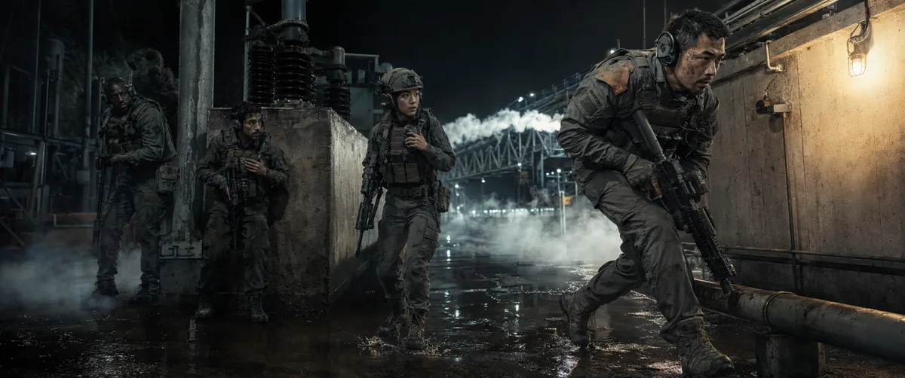
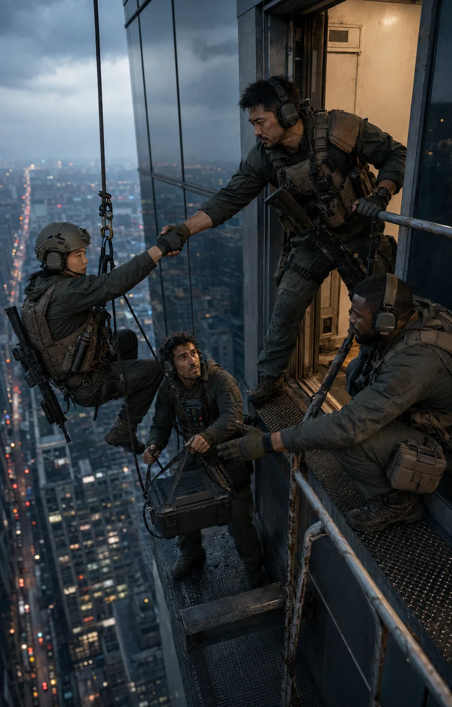

<div align="center">

<a href="docs/showcase/originals/xianxia-cloud-bell.png"></a>

*《云海钟境》｜项目自主生成、用户已接受；点击图片查看完整原图。*

# Open Film Skills｜开放影视技能

**从输入到可验收成片，让每个创作阶段有清楚的职责、交付和证据。**

*Independent Agent Skills for story, directing, visual assets, cinematography and AI-film production.*

[本轮研究成果](docs/RESEARCH.md) · [完整工作流](docs/WORKFLOW.md) · [21张用户接受视觉成果](#本轮21张用户接受视觉成果) · [全部21个技能](#全部21个独立技能) · [安装当前源码](docs/INSTALLATION.md#install-from-a-clone) · [版本与发布边界](#当前源码与下载版本) · [原创版权与商用](COMMERCIAL_USE.md)

**简体中文** · [日本語](docs/i18n/ja/README.md) · [한국어](docs/i18n/ko/README.md) · [English overview](#english-overview)


[](https://github.com/62656456/ai-film-skills/actions/workflows/validate.yml)
[](https://skills.sh/62656456/ai-film-skills)
[](LICENSE)

</div>

## 9 月研究更新：先看实际成果

**这一轮新增 7 组视频展示（8 个完整 MP4）、26 张研究样图与 3 份可编辑白模工程，并同步分镜导演 5.6.4 与古风视觉候选技能。** 下方保留原有 21 张已接受作品、历史白模和旧版本入口。新研究样例按实际进度标注，不与已接受作品混记。

[研究成果与方向](docs/RESEARCH.md) · [全部新图与实际提示词](docs/research/visual/index.md) · [全部白模与生成对照](docs/research/whitebox/index.md) · [下载当前源码](https://github.com/62656456/ai-film-skills/archive/refs/heads/main.zip)

### 最新 3D 白模：动作重排与多镜切换

<table>
<tr>
<td width="50%" valign="top"><a href="docs/research/whitebox/action-reblock-30s.mp4"></a><br/><strong>动作重排 · 30 秒 · 9/19</strong><br/>重新安排脚步、转身、手势与队伍展开，检查它们和连续运镜是否接得上。<br/><a href="docs/research/whitebox/action-reblock-30s.mp4">观看完整 MP4</a></td>
<td width="50%" valign="top"><a href="docs/research/whitebox/minimal-shots-30s.mp4"></a><br/><strong>极简分镜 · 30 秒 / 11 镜 · 9/18</strong><br/>用必要的代理形体检查站位、视线、走位、切镜和注意力变化。<br/><a href="docs/research/whitebox/minimal-shots-30s.mp4">观看完整 MP4</a></td>
</tr>
</table>

两条均为历史研究候选；GIF 保留完整时长，降低帧率与分辨率便于首页观看。它们展示简化关节代理和摄影实验，动作与审美仍待审；不证明最终 AI 成片。20 秒早期失败实验也保留在[研究演进页](docs/research/whitebox/index.md)。

### 从白模到生成片：看哪里继承、哪里偏离

https://github.com/user-attachments/assets/951b5ff1-86e0-4629-b6cc-c3e3d915c9e0

赛车案例把原白模与实际生成片上下对照，并配中文讲解。**原设计为 15 秒，生成时误选约 30 秒**；12.5–27.375 秒没有对应的原白模镜头，保留完整结果供检查。[完整视频、对应关系与许可说明](docs/research/whitebox/index.md)

<details>
<summary>展开观看三组完整原白模：追逐、博弈、棍术</summary>

**高速追击 · 15 秒 / 6 镜**

https://github.com/user-attachments/assets/7bbea66b-d855-47c4-a7b0-b628bbd7d208

**权力博弈 · 30 秒 / 8 镜**

https://github.com/user-attachments/assets/be73270a-9cea-49a4-b421-39b2ea15abd8

**棍术打戏 · 15 秒 / 7 镜**

https://github.com/user-attachments/assets/fef933aa-eee3-40b9-8930-feb019b4e507

[每组完整 MP4、参考图和实际提示词](docs/research/whitebox/index.md) · [可运行案例与交互预演台](https://github.com/62656456/ai-visual-previs-lab)

</details>

### 六种视觉风格：人物、环境和材质共同变化

<table>
<tr>
<td width="33%" valign="top"><a href="docs/research/visual/originals/style-film-realism.png"></a><br/><strong>胶片诗意写实</strong></td>
<td width="33%" valign="top"><a href="docs/research/visual/originals/style-mineral-painting.png"></a><br/><strong>东方岩彩</strong></td>
<td width="33%" valign="top"><a href="docs/research/visual/originals/style-copperplate-etching.png"></a><br/><strong>铜版线刻</strong></td>
</tr>
<tr>
<td width="33%" valign="top"><a href="docs/research/visual/originals/style-paper-theatre.png"></a><br/><strong>纸雕剧场</strong></td>
<td width="33%" valign="top"><a href="docs/research/visual/originals/style-needle-felt-v2.png"></a><br/><strong>羊毛毡定格感 · v2</strong></td>
<td width="33%" valign="top"><a href="docs/research/visual/originals/style-glazed-porcelain.png"></a><br/><strong>釉彩瓷偶</strong></td>
</tr>
</table>

胶片诗意写实、东方岩彩、铜版线刻、纸雕剧场、羊毛毡定格感与釉彩瓷偶，围绕相近题材进行探索。研究得到的具体方法是：风格规则必须覆盖人物和环境；羊毛毡版本针对水面进行了单独修订，避免真实液体与纤维世界混杂。六图为静态研究候选。[完整图、可复制提示词与风格规则](docs/research/visual/index.md)

### 古风真实感：让人物与环境处在同一束光里

<table>
<tr>
<td width="33%" valign="top"><a href="docs/research/visual/originals/guofeng-window-letter.png"></a><br/><strong>窗边家书 · 窗光</strong></td>
<td width="33%" valign="top"><a href="docs/research/visual/originals/guofeng-seedling-handoff.png"></a><br/><strong>田埂递秧 · 阴天</strong></td>
<td width="33%" valign="top"><a href="docs/research/visual/originals/guofeng-market-eaves.png"></a><br/><strong>檐下挑货 · 光影交界</strong></td>
</tr>
</table>

从“色彩与故事感成立、真实感不足”的六朝首图出发，继续修订肤色、照明与材质，再以窗边家书、田埂递秧、檐下挑货验证新的生活场景。新图仍待审阅。[六朝原图→修订对照与三张新场景](docs/research/visual/index.md) · [古风技能 0.1.1 候选源码](experimental/guofeng-visual-director/SKILL.md)

### 研究已经写进哪些技能

| 研究问题 | 本轮可直接使用的结果 | 查看 |
|---|---|---|
| 分镜与提示词重复，摄影意图容易在编译时丢失 | 分镜 5.6.4：一份融合六段母稿，第六段承载完整镜头时间轴；打戏和运镜诊断仍在同一个入口 | [源码](skills/ai-storyboard-director/SKILL.md) |
| 古风容易变成固定朝代、固定柔光和统一人像 | 新增古风 0.1.1 实验包：文化依据、生活空间、人物器物、光色和结果检查 | [源码](experimental/guofeng-visual-director/SKILL.md) |
| 资产脱离剧情时间线，人物与环境缺少使用逻辑 | 剧本驱动人物、场景、道具设计；人物魅力研究附五张实际肖像 | [研究结果](docs/RESEARCH.md) |
| 战争画面只换背景，小队动作趋同 | 战争视觉、军事装备与小队摄影合为一个入口；五张已接受作品继续在下方展示 | [战争技能](skills/war-design/SKILL.md) |
| 新方法是否在别的任务仍成立 | 公开失败与修订、提出风格迁移／镜头执行／动作连续性下一轮验证方向 | [研究方向](docs/RESEARCH.md#接下来研究什么) |

## 从输入到成片：完整工作流


[查看全部节点、交接与返回线](docs/WORKFLOW.md) · [下载完整Mermaid源图](docs/assets/production-workflow.mmd)

点子、小说、大纲、剧本、参考图或已有镜头都可以成为入口。已有可用成果就从相应阶段继续，按需选择主Skill；每项技能自带运行正文和必要引用，不要求先加载整个工作室。

完整工作流列出 **21项影视职责＋1项网页辅助**。其中外部仙侠只提供上游链接，本仓库实际分发 **18项常规＋3项实验＝21个模块**，对应 **42份英文/简体中文指南**。

## 当前源码与下载版本

| 入口 | 当前口径 |
|---|---|
| [当前源码](skills/ai-storyboard-director/SKILL.md) | 分镜入口为 **5.6.4**，已选择日常使用；增加紧凑提示词编译、打戏因果与受力设计，以及推进/变焦、横移/摇摄/环绕的按需诊断 |
| [已发布v1.3.0](https://github.com/62656456/ai-film-skills/releases/tag/v1.3.0) | **旧发布快照**，分镜是 **5.4.4**；源码更新不改变旧ZIP |
| 5.6独立Preview | 另有标签和清单的独立预览包，与当前源码及完整套装Release分别记录 |

本次更新源码、研究成果与展示；v1.3.0 和独立 Preview 继续保留各自历史内容。要用当前源码，请检查所取分支/提交与`SKILL.md`版本；旧Release适合明确复现旧快照。[安装选择与验证](docs/INSTALLATION.md)

## 全部21个独立技能

当前仓库收录 **18项常规包＋3项实验包**，下面逐项列出用途、源码版本和直接入口。版本列的“—”表示该包`SKILL.md`没有单独声明技能版本号，以实际Git提交和完整文件为准；不把模板中的资产版本、JSON协议版本或仓库Release号当成Skill版本。

| 技能 / 职责 | 逐项用途 | 当前源码版本 | 分发 | 入口 |
|---|---|---|---|---|
| `director-agent`<br/>编剧与导演 | 写作、改稿、对白与人物因果诊断；导演方案和条件式AI执行剧本 | — | 常规 | [运行正文](skills/director-agent/SKILL.md) · [中文说明](docs/skills/zh-CN/director-agent.md) |
| `ai-storyboard-director`<br/>分镜与摄影 | 将可用剧本设计为一条融合六段母稿，第六段含完整镜头时间轴；在作品目录保存恢复镜头决定 | 5.6.4 | 常规 | [运行正文](skills/ai-storyboard-director/SKILL.md) · [中文说明](docs/skills/zh-CN/ai-storyboard-director.md) |
| `character-asset`<br/>人物资产 | 人物身份、外形、必要视图、表情与可变状态的参考任务和资产合同 | — | 常规 | [运行正文](skills/character-asset/SKILL.md) · [中文说明](docs/skills/zh-CN/character-asset.md) |
| `scene-asset`<br/>场景资产 | 场景拓扑、空间锚点、光源、材质和连续性参考图/提示词 | — | 常规 | [运行正文](skills/scene-asset/SKILL.md) · [中文说明](docs/skills/zh-CN/scene-asset.md) |
| `prop-asset`<br/>道具资产 | 道具结构、比例、可见面、持用和新旧状态；按要求交单图或必要视图 | — | 常规 | [运行正文](skills/prop-asset/SKILL.md) · [中文说明](docs/skills/zh-CN/prop-asset.md) |
| `cyberpunk-design`<br/>赛博朋克 | 身体与技术关系、功能光源、空间层级和材质；不强制雨夜霓虹 | — | 常规 | [运行正文](skills/cyberpunk-design/SKILL.md) · [中文说明](docs/skills/zh-CN/cyberpunk-design.md) |
| `epic-design`<br/>史诗 | 地形、建筑、群体与个人代价共同建立尺度和画面秩序 | — | 常规 | [运行正文](skills/epic-design/SKILL.md) · [中文说明](docs/skills/zh-CN/epic-design.md) |
| `fantasy-design`<br/>奇幻 | 魔法来源、作用目标、世界规则和环境反馈的视觉参数 | — | 常规 | [运行正文](skills/fantasy-design/SKILL.md) · [中文说明](docs/skills/zh-CN/fantasy-design.md) |
| `horror-design`<br/>恐怖 | 可见异常证据、威胁显露、空间不安与可读暗部 | — | 常规 | [运行正文](skills/horror-design/SKILL.md) · [中文说明](docs/skills/zh-CN/horror-design.md) |
| `noir-design`<br/>黑色与犯罪 | 秘密、犯罪、关系压力和明暗信息；不以黑白滤镜替代剧情 | — | 常规 | [运行正文](skills/noir-design/SKILL.md) · [中文说明](docs/skills/zh-CN/noir-design.md) |
| `romance-design`<br/>爱情 | 距离、视线、接触和双向行动表达关系，不固定粉色、暖光或拥抱 | — | 常规 | [运行正文](skills/romance-design/SKILL.md) · [中文说明](docs/skills/zh-CN/romance-design.md) |
| `war-design`<br/>战争 | 地形、协同、负荷、行动与后果；检查武器方向和接触关系 | — | 常规 | [运行正文](skills/war-design/SKILL.md) · [中文说明](docs/skills/zh-CN/war-design.md) |
| `wuxia-design`<br/>武侠 | 兵器、步法、支撑、衣发反馈与东方空间的可观察参数 | — | 常规 | [运行正文](skills/wuxia-design/SKILL.md) · [中文说明](docs/skills/zh-CN/wuxia-design.md) |
| `produce-ai-video`<br/>实际视频生产 | 统筹实际生成、选片、剪辑、对白音效、完整播放审查与修复 | — | 常规 | [运行正文](skills/produce-ai-video/SKILL.md) · [中文说明](docs/skills/zh-CN/produce-ai-video.md) |
| `ai-short-drama-production`<br/>短剧控制 | 保留2026-09-07按5.6.0建立的独立合同：五列分镜＋六模块提示词；文本验证通过，实片待验 | — | 常规；未部署 | [运行正文](skills/ai-short-drama-production/SKILL.md) · [中文说明](docs/skills/zh-CN/ai-short-drama-production.md) |
| `web-design-director`<br/>网页辅助 | 明确网页或应用界面任务时设计与审核；仓库README维护不触发建站 | — | 常规 | [运行正文](skills/web-design-director/SKILL.md) · [中文说明](docs/skills/zh-CN/web-design-director.md) |
| `d-official-market-analysis`<br/>市场研究 | 根据当前可验证来源研究题材、平台、受众与制作机会，保留数据局限 | — | 常规 | [运行正文](skills/d-official-market-analysis/SKILL.md) · [中文说明](docs/skills/zh-CN/d-official-market-analysis.md) |
| `d-data-analysis-semantic-layer`<br/>知识审核与写入 | 用户批准后校验来源、版本、有效期与冲突，写入明确目标并回读 | — | 常规 | [运行正文](skills/d-data-analysis-semantic-layer/SKILL.md) · [中文说明](docs/skills/zh-CN/d-data-analysis-semantic-layer.md) |
| `hard-sci-fi-visual-director`<br/>硬科幻视觉 | 从物理、功能、制造与环境推导原创世界、设备、形体和完整提示词 | — | 实验 | [运行正文](experimental/hard-sci-fi-visual-director/SKILL.md) · [中文说明](docs/skills/zh-CN/hard-sci-fi-visual-director.md) |
| `whitebox-previs-executor`<br/>3D白模预演 | 将已有镜头编译成可播放机位与基础走位预演；打斗限已实现且过门的动作 | — | 实验 | [运行正文](experimental/whitebox-previs-executor/SKILL.md) · [中文说明](docs/skills/zh-CN/whitebox-previs-executor.md) |
| `guofeng-visual-director`<br/>古风视觉 | 文化依据、生活空间、人物器物、光色与图像提示词；附真实候选图 | 0.1.1 | 实验候选 | [运行正文](experimental/guofeng-visual-director/SKILL.md) · [中文说明](docs/skills/zh-CN/guofeng-visual-director.md) |

**分发状态与完成证据分开。** 常规包不表示所有能力已通过实战；实验硬科幻已有接受图例，白模仍有明确能力限制。短剧控制器保留2026-09-07按5.6.0建立的独立交付合同，未随分镜5.6.4改为融合单稿；其独立文本行为样本经修正后最终通过，仍未部署、未生成视频、未获用户实际效果验收，不新增独立版本号。其余实际使用和验收边界见各自运行正文与说明。

外部[xianxia-visual-director](https://github.com/liyue-aigc/xianxia-visual-director)只作为仙侠工作流入口，不属于这21个源码包、不进本仓库ZIP；《云海钟境》是本项目自主生成并已接受的示例图，图的发布不等于再分发外部技能源码。

## 安装当前源码中的一个Skill

```bash
git clone https://github.com/62656456/ai-film-skills.git
cd ai-film-skills
git log -1 --oneline
python scripts/install_skill.py --list
python scripts/install_skill.py ai-storyboard-director --platform codex
```

安装器使用当前检出的源码；公共默认分支不会自动包含未推送的本地修改。安装前查看所选源码版本，然后在Agent中调用：

```text
使用 $ai-storyboard-director，把下面剧本设计成一条融合六段母稿，在第六段写完整的人读镜头时间轴。
保留已确认剧情、人物与台词；镜头标题直接显示具体摄影方案。
如果我提供了作品目录，请实际保存导演意图、选中镜头和场景状态，并核对恢复结果。
[粘贴剧本与已有约束]
```

也可用Skills CLI查看公共仓库的可发现条目，再按需要安装；该路线读取公共来源，不会取得未推送的本地修改：

```bash
npx --yes skills@latest add 62656456/ai-film-skills --list
npx --yes skills@latest add 62656456/ai-film-skills --skill ai-storyboard-director --agent codex --copy --yes
```

[skills.sh公开目录](https://skills.sh/62656456/ai-film-skills)显示平台自己的安装统计，其中包含维护者验证，不等于独立外部用户数。

其他宿主、历史ZIP与实验包的明确安装方式见[安装指南](docs/INSTALLATION.md)和[兼容边界](docs/COMPATIBILITY.md)。Skills CLI的[旧版发现与复制记录](examples/skills-cli-install-verification.md)保留为历史证据，不冒充本轮5.6宿主行为测试。

## 本轮21张用户接受视觉成果

以下19张是原创生成静帧，另有2张是原创LUMEN界面的真实浏览器截图；用户均已逐批明确接受。预览保持原始比例，点击进入原始PNG，没有裁切成卡片来隐藏边缘。仙侠技能本体来自外部，仅链接上游，图是本轮授权生成的原创成果。

<table>
<tr>
<td width="50%" valign="top"><a href="docs/showcase/originals/cyberpunk-after-the-new-eye.png"></a><br /><strong>《换眼之后》</strong><br />赛博朋克：身体、技术与人的处境。</td>
<td width="50%" valign="top"><a href="docs/showcase/originals/epic-open-gates.png"></a><br /><strong>《开门》</strong><br />史诗：群体规模与门前的个人命运。</td>
</tr>
<tr>
<td width="50%" valign="top"><a href="docs/showcase/originals/fantasy-mending-the-bridge.png"></a><br /><strong>《重续断桥》</strong><br />奇幻：魔法作用、石桥与跨越。</td>
<td width="50%" valign="top"><a href="docs/showcase/originals/horror-upstairs-visitor.png"></a><br /><strong>《楼上的访客》</strong><br />恐怖：可读空间中的异常证据。</td>
</tr>
<tr>
<td width="50%" valign="top"><a href="docs/showcase/originals/noir-before-the-money.png"></a><br /><strong>《收钱之前》</strong><br />黑色：证据、封口费与未完成交易。</td>
<td width="50%" valign="top"><a href="docs/showcase/originals/romance-tilted-umbrella.png"></a><br /><strong>《把伞偏过去》</strong><br />爱情：系鞋与偏伞的双向照顾。</td>
</tr>
<tr>
<td width="50%" valign="top"><a href="docs/showcase/originals/war-river-crossing.png"></a><br /><strong>《渡河》</strong><br />战争：负荷、协同与渡河行动。</td>
<td width="50%" valign="top"><a href="docs/showcase/originals/wuxia-tea-still-warm.png"></a><br /><strong>《茶未凉》</strong><br />武侠：日常空间中的兵器与关系压力。</td>
</tr>
<tr>
<td width="50%" valign="top"><a href="docs/showcase/originals/hard-scifi-orbital-morning.png"></a><br /><strong>《环城清晨》</strong><br />硬科幻：轨道生活与细小照料。</td>
<td width="50%" valign="top"><a href="docs/showcase/originals/hard-scifi-lunar-lightfield.png"></a><br /><strong>《极昼镜阵》</strong><br />硬科幻：月面系统、尺度与日照。</td>
</tr>
<tr>
<td width="50%" valign="top"><a href="docs/showcase/originals/hard-scifi-titan-harbor.png"></a><br /><strong>《泰坦泊岸》</strong><br />硬科幻：环境与装备形态。</td>
<td width="50%" valign="top"><a href="docs/showcase/originals/hard-scifi-mars-first-harvest.png"></a><br /><strong>《火星的第一颗番茄》</strong><br />硬科幻：农业系统与收获。</td>
</tr>
<tr>
<td width="50%" valign="top"><a href="docs/showcase/originals/hard-scifi-europa-underice.png"></a><br /><strong>《冰壳下的来客》</strong><br />硬科幻：冰下环境与探测。</td>
<td width="50%" valign="top"><a href="docs/showcase/originals/xianxia-cloud-bell.png"></a><br /><strong>《云海钟境》</strong><br />仙侠：外部技能路线的原创成图。</td>
</tr>
<tr>
<td width="50%" valign="top"><a href="docs/showcase/originals/war-bold-black-shadow-advance.png"></a><br /><strong>《黑影前行》</strong><br />贴地广角、实用光源和四人差异化动作。</td>
<td width="50%" valign="top"><a href="docs/showcase/originals/war-bold-suspended-city-landing.png"></a><br /><strong>《悬城落点》</strong><br />高差、绳索承托、器材负荷和协作关系。</td>
</tr>
<tr>
<td width="50%" valign="top"><a href="docs/showcase/originals/war-bold-red-sand-contact.png"></a><br /><strong>《赤沙交锋》</strong><br />过肩近景、局部碎屑和不同步的队员反应。</td>
<td width="50%" valign="top"><a href="docs/showcase/originals/war-bold-floodgate-blue.png"></a><br /><strong>《潮门幽蓝》</strong><br />水阻、低矮障碍、共同承重和警戒分工。</td>
</tr>
<tr>
<td width="50%" valign="top"><a href="docs/showcase/originals/war-bold-snowline-backlight.png"></a><br /><strong>《雪线逆光》</strong><br />雪地阻力、错落队形、援手和明确目的地。</td>
<td width="50%" valign="top"><a href="docs/showcase/originals/web-design-lumen-desktop-confirmed.png"></a><br /><strong>LUMEN·桌面端</strong><br />收藏结果、再次回访入口和本地保存边界同时可见。</td>
</tr>
<tr>
<td width="50%" valign="top"><a href="docs/showcase/originals/web-design-lumen-mobile-favorites.png"></a><br /><strong>LUMEN·手机端</strong><br />390像素宽度下保留收藏、身份和回访路径。</td>
</tr>
</table>

[查看逐文件来源、版本、哈希与接受记录](docs/showcase/manifest.json)。这21张证明对应静帧或界面结果已通过用户审阅；五张战争小队图来自一次接受批次，两张LUMEN截图来自一次接受的界面交付，不能据此宣称跨任务稳定、真人可用性研究、所有题材成功或视频执行通过。

## 本轮视觉方法更新了什么

视觉与资产模块先确定成像方式和观看命题，再联合设计主体分离、光源及反射、空间尺度、材料差异和细节层次。每包都带自己的画面关系参考，单独复制仍可读取。

- 配色、焦段、光比、浅景深、前景人物和黄金时刻是可选设计，不是万能要求。
- 摄影写实、三维动画、二维动画/插画采用各自的失败标准；新物、真实塑料和设计发光不被通用负向误杀。
- 用户只要单图或提示词时，先交付点名结果；真实像素检查、连续视频检查和用户决定分别记录。

这些方法是本项目对用户供图关系分析的原创综合，不声称反推出第三方Skill、模型或未提供的摄影参数。

## 9 月技能研究积累

- `ai-storyboard-director` 5.6.4 仍保持一个分镜入口：普通任务按阶段读取；打戏另读攻防、接触阻力、节奏和摄影设计；只有用户要求运镜对照或诊断时，才读取推进/变焦与横移/摇摄/环绕的可见证据方法。内部格式、隔离和文本回归通过；真实视频和用户审美仍待验。
- 人物、场景和道具资产先通读剧本并区分明示事实与设计推定。人物默认交三面全身加中景，女性魅力按任务读取独立参考；场景无指定画风时默认摄影写实，并从用途、使用者、维护、天气和事件痕迹推导可信环境；道具继续围绕功能、接触和状态变化设计。
- `war-design` 1.0.0 合并战争类型视觉与军事顾问方法，覆盖故事关键帧、战斗、小队摄影和实际画面审查；它不认证真实战术、装备性能或任意视频结果。
- `web-design-director` 1.3.0 将优秀成品观察、开源实现与许可核对连接到具体设计机制，并把任务走查、布局实用性、材质、动效和交互恢复分开验证。本次升级获用户确认，不等同于跨项目、跨设备或真人研究结论。

上述 9 月 11 日记录保留其原始范围。本次 9 月 21 日另增明确标注的研究候选图与白模；旧接受状态和 v1.3.0 附件保持各自记录。

## See the Skills in motion

历史预演证据展示了可观看的机位、走位与短动作门，保留原验收范围：

<table>
<tr>
<td width="50%" valign="top"><a href="https://62656456.github.io/ai-film-skills/media/previs-blocking-5s.mp4"></a><br /><strong>基础机位与走位 · 5秒</strong></td>
<td width="50%" valign="top"><a href="https://62656456.github.io/ai-film-skills/media/rigged-contact-gate-2.8s.mp4"></a><br /><strong>骨骼接触动作门 · 2.8秒</strong></td>
</tr>
</table>

白模执行器现作为源码中的独立实验包列出；这些历史片段证明有限预演与动作门，不证明任意完整打斗、最终AI成片或新的用户接受。[媒体清单](docs/media/media-manifest.json)

[旧5.4.4文字行为案例](examples/storyboard-director-5.4.4-visible-camera-plan.md)和[历史视觉参考墙](docs/style-gallery/manifest.json)仍可查看，保留各自日期与原状态，不与本轮21张接受视觉成果混记。

## 模块和证据边界

常规包可单独使用；实验硬科幻、白模与古风候选不进入默认完整套装。短剧控制器保留按5.6.0建立的独立五列分镜＋六模块合同，未采用5.6.4融合单稿，仍未部署；文本验证不替代真实视频和用户验收。外部仙侠没有已核实再分发许可，因此不复制源码、不进ZIP；完整职责见[工作流](docs/WORKFLOW.md)。

结构有效、宿主实际加载、真实任务输出、媒体检查与用户接受是不同证据。5.6的状态程序不评审美，不替代实际读剧本，也不能强制所有聊天入口执行。费用、账户、工具和发布权限由实际任务与宿主决定。

[21模块目录](SKILL_CATALOG.md) · [42份设计指南](docs/skills/INDEX.md) · [共同审核逻辑](docs/SKILL_DESIGN_SYSTEM.md) · [分发范围](PUBLICATION_SCOPE.md)

## English overview

Open Film Skills provides **21 self-contained modules: 18 regular and 3 experimental**, with 42 English/Simplified Chinese guides. The [full workflow](docs/WORKFLOW.md) covers input, writing, directing, visual language, assets, shots, prompts, optional previs, actual video production, sound, playback review and acceptance. It lists one external xianxia workflow entry without redistributing its source.

The September 21 update adds 26 original research images, seven video showcases (eight complete MP4 files), and the guofeng 0.1.1 candidate. Prior accepted showcases remain intact. [Research findings and next directions](docs/RESEARCH.md). Current source uses Storyboard Director 5.6.4. Published v1.3.0 ZIPs preserve the historical 5.4.4 snapshot; the separately labeled 5.6 Preview is another artifact. Source updates do not publish a new Release. The 2026-09-11 source increment adds compact prompt compilation, fight design, camera-motion diagnostics, script-first asset derivation, unified war-film visual methods, and research-to-design web guidance with explicit evidence limits. The primary showcase contains 19 generated stills and two browser screenshots explicitly accepted by the user, displayed without cropping; it is not a measured old/new A/B study or a guarantee of general reliability.

Start with the [catalog](SKILL_CATALOG.md), [source installation](docs/INSTALLATION.md) or [per-module English guides](docs/skills/INDEX.md).

## 贡献、来源与许可

[贡献说明](CONTRIBUTING.md) · [安全反馈](SECURITY.md) · [第三方说明](THIRD_PARTY_NOTICES.md) · [GitHub Discussions](https://github.com/62656456/ai-film-skills/discussions) · [Issues](https://github.com/62656456/ai-film-skills/issues)

本仓库原创Skill、脚本、文档、提示词和明确项目自主生成的示例，在权利人有权许可的范围内按[Apache License 2.0](LICENSE)允许个人与商业使用、修改、集成和再分发；保留适用许可说明、注明文件变更，不要求衍生项目全部开源。本轮19张成图属于项目原创AI辅助样本，2张界面图属于原创原型的浏览器截图，均经人工参与设计、筛选、修订与接受；不承诺AI输出独一无二。新作品仍需遵守实际平台条款与输入素材、肖像、商标等权利，外部仙侠链接不授予其源码许可。

[阅读完整原创版权与商用说明](COMMERCIAL_USE.md) · [第三方范围](THIRD_PARTY_NOTICES.md)
