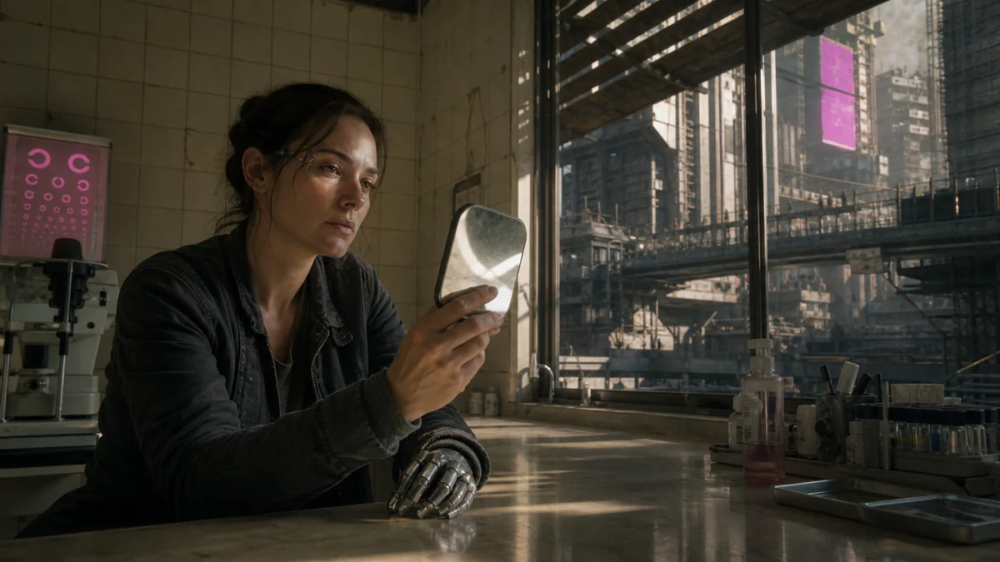
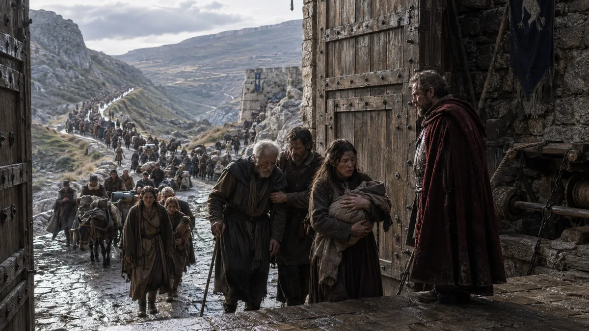
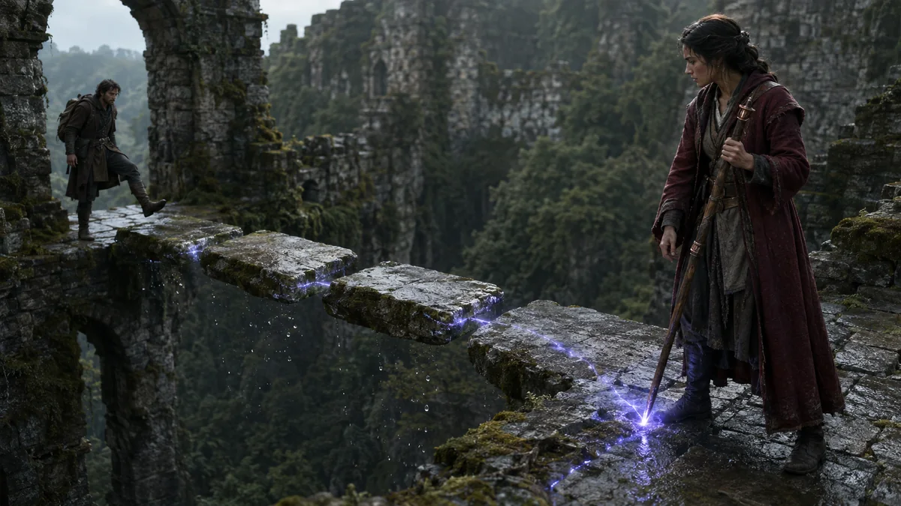
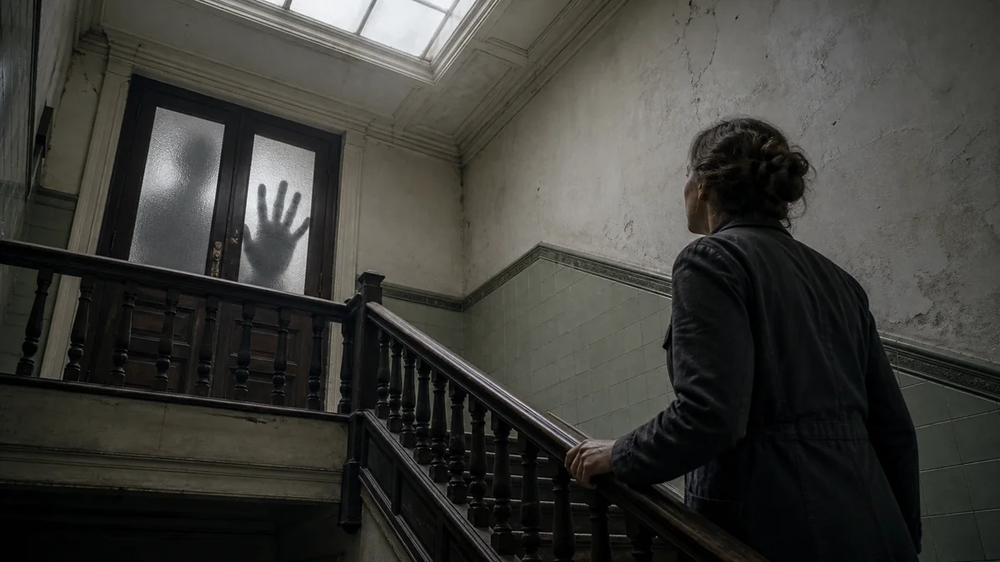
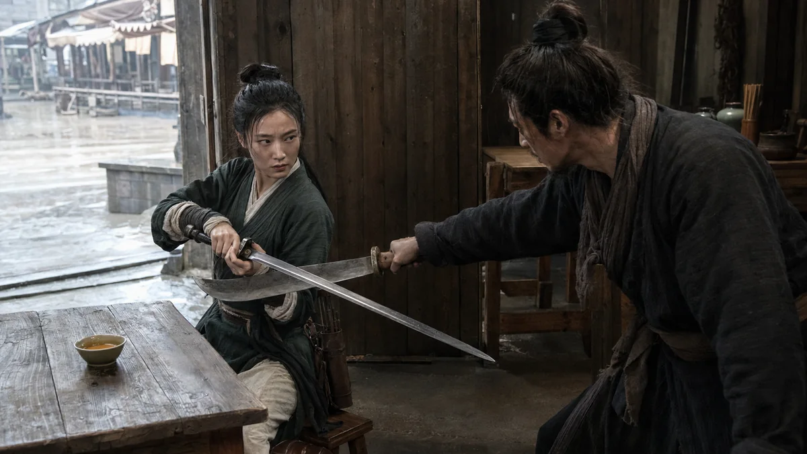
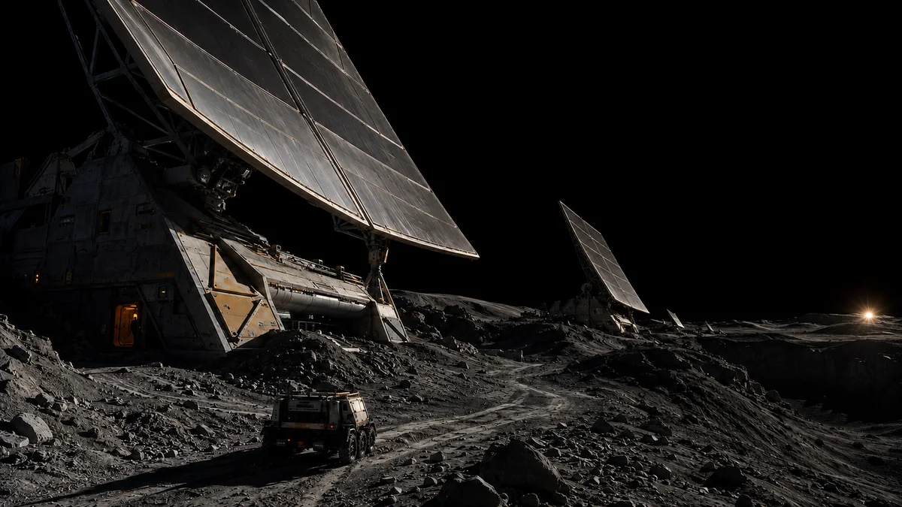
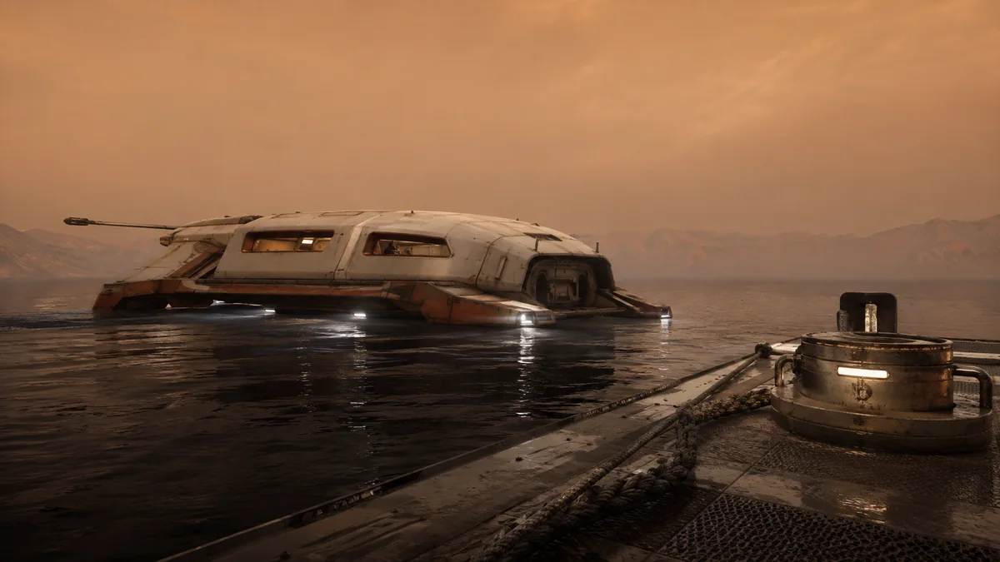
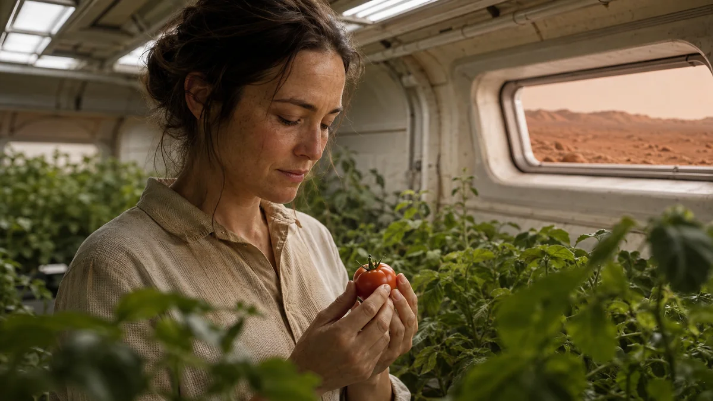
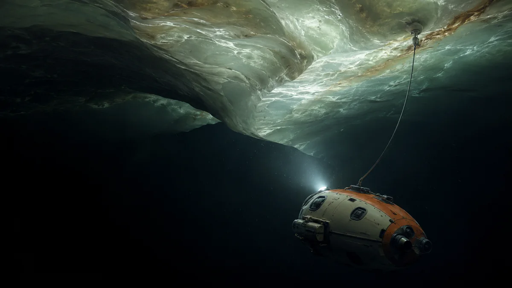

<div align="center">


# Open Film Skills｜开放影视技能

**从输入到可验收成片，让每个创作阶段有清楚的职责、交付和证据。**

*Independent Agent Skills for story, directing, visual assets, cinematography and AI-film production.*

[完整工作流](docs/WORKFLOW.md) · [14张用户接受成图](#本轮14张用户接受成图) · [按任务选Skill](SKILL_CATALOG.md) · [安装当前源码](docs/INSTALLATION.md#install-from-a-clone) · [版本与发布边界](#当前源码与下载版本) · [原创版权与商用](COMMERCIAL_USE.md)

**简体中文** · [日本語](docs/i18n/ja/README.md) · [한국어](docs/i18n/ko/README.md) · [English overview](#english-overview)


[](https://github.com/62656456/ai-film-skills/actions/workflows/validate.yml)
[](https://skills.sh/62656456/ai-film-skills)
[](LICENSE)

</div>

## 从输入到成片：完整工作流


[查看全部节点、交接与返回线](docs/WORKFLOW.md) · [下载完整Mermaid源图](docs/assets/production-workflow.mmd)

点子、小说、大纲、剧本、参考图或已有镜头都可以成为入口。已有可用成果就从相应阶段继续，按需选择主Skill；每项技能自带运行正文和必要引用，不要求先加载整个工作室。

完整工作流列出 **20项影视职责＋1项网页辅助**。其中外部仙侠只提供上游链接，本仓库实际分发 **18项常规＋2项实验＝20个模块**，对应 **40份英文/简体中文指南**。

## 当前源码与下载版本

| 入口 | 当前口径 |
|---|---|
| [当前源码](skills/ai-storyboard-director/SKILL.md) | 分镜入口为 **5.6**，已选择日常使用；增加作品内导演意图、镜头和状态的保存恢复，以及摄影设计在提示词编译中的保留检查 |
| [已发布v1.3.0](https://github.com/62656456/ai-film-skills/releases/tag/v1.3.0) | **旧发布快照**，分镜是 **5.4.4**；源码更新不改变旧ZIP |
| 5.6独立Preview | 另有标签和清单的独立预览包，与当前源码及完整套装Release分别记录 |

本轮是源码与文档刷新，不能把它称为已经发布新Release。要用当前源码，请检查所取分支/提交与`SKILL.md`版本；旧Release适合明确复现旧快照。[安装选择与验证](docs/INSTALLATION.md)

## 从一个结果开始

| 你要的结果 | 入口 | 直接交付 |
|---|---|---|
| 写剧本、改对白、解决因果与人物问题 | [director-agent](docs/skills/zh-CN/director-agent.md) | 可读剧本、可替换段落或导演方案；明确需要时另编译AI执行层 |
| 将已有剧本做成镜头和提示词 | [ai-storyboard-director](docs/skills/zh-CN/ai-storyboard-director.md) | 五列分镜＋完整六模块母提示词；明确作品目录中的5.6保存与恢复 |
| 人物、场景、道具参考 | [character-asset](docs/skills/zh-CN/character-asset.md) · [scene-asset](docs/skills/zh-CN/scene-asset.md) · [prop-asset](docs/skills/zh-CN/prop-asset.md) | 按需的单图/必要视图、提示词与状态合同 |
| 类型视觉方向 | [8项常规类型](SKILL_CATALOG.md#genre-visual-language) · [硬科幻实验](docs/skills/zh-CN/hard-sci-fi-visual-director.md) · [外部仙侠](https://github.com/liyue-aigc/xianxia-visual-director) | 构图、光影、色彩、材质、空间与动作参数 |
| 生成前看机位和基础走位 | [whitebox-previs-executor](docs/skills/zh-CN/whitebox-previs-executor.md) | 实验3D预演MP4；仅实现的代理和已过门动作 |
| 实际生成、剪辑与验收视频 | [produce-ai-video](docs/skills/zh-CN/produce-ai-video.md) | 在工具和权限可用时统筹真实视频、声音、完整播放与修复 |
| 选题、平台或知识沉淀 | [市场研究](docs/skills/zh-CN/d-official-market-analysis.md) · [批准后写入](docs/skills/zh-CN/d-data-analysis-semantic-layer.md) | 有来源的研究；知识写入另需明确批准 |
| 专项短剧控制、作品站或资产工作台 | [短剧控制](docs/skills/zh-CN/ai-short-drama-production.md) · [网页设计](docs/skills/zh-CN/web-design-director.md) | 短剧控制合同（未部署、需核对5.6交接）；网页设计与实际渲染审核 |

## 安装当前源码中的一个Skill

```bash
git clone https://github.com/62656456/ai-film-skills.git
cd ai-film-skills
git log -1 --oneline
python scripts/install_skill.py --list
python scripts/install_skill.py ai-storyboard-director --platform codex
```

安装器使用当前检出的源码；公共默认分支不会自动包含未推送的本地修改。安装前查看所选源码版本，然后在Agent中调用：

```text
使用 $ai-storyboard-director，把下面剧本设计成人读分镜和一条完整视频母提示词。
保留已确认剧情、人物与台词；镜头标题直接显示具体摄影方案。
如果我提供了作品目录，请实际保存导演意图、选中镜头和场景状态，并核对恢复结果。
[粘贴剧本与已有约束]
```

也可用Skills CLI查看公共仓库的可发现条目，再按需要安装；该路线读取公共来源，不会取得未推送的本地修改：

```bash
npx --yes skills@latest add 62656456/ai-film-skills --list
npx --yes skills@latest add 62656456/ai-film-skills --skill ai-storyboard-director --agent codex --copy --yes
```

[skills.sh公开目录](https://skills.sh/62656456/ai-film-skills)显示平台自己的安装统计，其中包含维护者验证，不等于独立外部用户数。

其他宿主、历史ZIP与实验包的明确安装方式见[安装指南](docs/INSTALLATION.md)和[兼容边界](docs/COMPATIBILITY.md)。Skills CLI的[旧版发现与复制记录](examples/skills-cli-install-verification.md)保留为历史证据，不冒充本轮5.6宿主行为测试。

## 本轮14张用户接受成图

以下均为原创生成结果，用户已逐批明确接受。预览保留完整画幅，点击进入原始PNG；没有裁切成卡片来隐藏边缘。包括8类型、5张硬科幻与1张仙侠；仙侠技能本体来自外部，仅链接上游，图是本轮授权生成的原创成果。

<table>
<tr>
<td width="50%" valign="top"><a href="docs/showcase/originals/cyberpunk-after-the-new-eye.png"></a><br /><strong>《换眼之后》</strong><br />赛博朋克：身体、技术与人的处境。</td>
<td width="50%" valign="top"><a href="docs/showcase/originals/epic-open-gates.png"></a><br /><strong>《开门》</strong><br />史诗：群体规模与门前的个人命运。</td>
</tr>
<tr>
<td width="50%" valign="top"><a href="docs/showcase/originals/fantasy-mending-the-bridge.png"></a><br /><strong>《重续断桥》</strong><br />奇幻：魔法作用、石桥与跨越。</td>
<td width="50%" valign="top"><a href="docs/showcase/originals/horror-upstairs-visitor.png"></a><br /><strong>《楼上的访客》</strong><br />恐怖：可读空间中的异常证据。</td>
</tr>
<tr>
<td width="50%" valign="top"><a href="docs/showcase/originals/noir-before-the-money.png"></a><br /><strong>《收钱之前》</strong><br />黑色：证据、封口费与未完成交易。</td>
<td width="50%" valign="top"><a href="docs/showcase/originals/romance-tilted-umbrella.png"></a><br /><strong>《把伞偏过去》</strong><br />爱情：系鞋与偏伞的双向照顾。</td>
</tr>
<tr>
<td width="50%" valign="top"><a href="docs/showcase/originals/war-river-crossing.png"></a><br /><strong>《渡河》</strong><br />战争：负荷、协同与渡河行动。</td>
<td width="50%" valign="top"><a href="docs/showcase/originals/wuxia-tea-still-warm.png"></a><br /><strong>《茶未凉》</strong><br />武侠：日常空间中的兵器与关系压力。</td>
</tr>
<tr>
<td width="50%" valign="top"><a href="docs/showcase/originals/hard-scifi-orbital-morning.png"></a><br /><strong>《环城清晨》</strong><br />硬科幻：轨道生活与细小照料。</td>
<td width="50%" valign="top"><a href="docs/showcase/originals/hard-scifi-lunar-lightfield.png"></a><br /><strong>《极昼镜阵》</strong><br />硬科幻：月面系统、尺度与日照。</td>
</tr>
<tr>
<td width="50%" valign="top"><a href="docs/showcase/originals/hard-scifi-titan-harbor.png"></a><br /><strong>《泰坦泊岸》</strong><br />硬科幻：环境与装备形态。</td>
<td width="50%" valign="top"><a href="docs/showcase/originals/hard-scifi-mars-first-harvest.png"></a><br /><strong>《火星的第一颗番茄》</strong><br />硬科幻：农业系统与收获。</td>
</tr>
<tr>
<td width="50%" valign="top"><a href="docs/showcase/originals/hard-scifi-europa-underice.png"></a><br /><strong>《冰壳下的来客》</strong><br />硬科幻：冰下环境与探测。</td>
<td width="50%" valign="top"><a href="docs/showcase/originals/xianxia-cloud-bell.png"></a><br /><strong>《云海钟境》</strong><br />仙侠：外部技能路线的原创成图。</td>
</tr>
</table>

[查看逐文件来源、版本、哈希与接受记录](docs/showcase/manifest.json)。这14张证明相应图例已通过用户审阅；没有旧版同题A/B，不能据此宣称量化升级、所有题材稳定成功或视频执行通过。

## 本轮视觉方法更新了什么

视觉与资产模块先确定成像方式和观看命题，再联合设计主体分离、光源及反射、空间尺度、材料差异和细节层次。每包都带自己的画面关系参考，单独复制仍可读取。

- 配色、焦段、光比、浅景深、前景人物和黄金时刻是可选设计，不是万能要求。
- 摄影写实、三维动画、二维动画/插画采用各自的失败标准；新物、真实塑料和设计发光不被通用负向误杀。
- 用户只要单图或提示词时，先交付点名结果；真实像素检查、连续视频检查和用户决定分别记录。

这些方法是本项目对用户供图关系分析的原创综合，不声称反推出第三方Skill、模型或未提供的摄影参数。

## See the Skills in motion

历史预演证据展示了可观看的机位、走位与短动作门，保留原验收范围：

<table>
<tr>
<td width="50%" valign="top"><a href="https://62656456.github.io/ai-film-skills/media/previs-blocking-5s.mp4"></a><br /><strong>基础机位与走位 · 5秒</strong></td>
<td width="50%" valign="top"><a href="https://62656456.github.io/ai-film-skills/media/rigged-contact-gate-2.8s.mp4"></a><br /><strong>骨骼接触动作门 · 2.8秒</strong></td>
</tr>
</table>

白模执行器现作为源码中的独立实验包列出；这些历史片段证明有限预演与动作门，不证明任意完整打斗、最终AI成片或新的用户接受。[媒体清单](docs/media/media-manifest.json)

[旧5.4.4文字行为案例](examples/storyboard-director-5.4.4-visible-camera-plan.md)和[历史视觉参考墙](docs/style-gallery/manifest.json)仍可查看，保留各自日期与原状态，不与本轮14张接受成图混记。

## 模块和证据边界

常规包可单独使用；实验硬科幻与白模不进入默认完整套装。已封装的短剧控制器尚未部署，使用前须核对现行5.6交接。外部仙侠没有已核实再分发许可，因此不复制源码、不进ZIP；完整职责见[工作流](docs/WORKFLOW.md)。

结构有效、宿主实际加载、真实任务输出、媒体检查与用户接受是不同证据。5.6的状态程序不评审美，不替代实际读剧本，也不能强制所有聊天入口执行。费用、账户、工具和发布权限由实际任务与宿主决定。

[20模块目录](SKILL_CATALOG.md) · [40份设计指南](docs/skills/INDEX.md) · [共同审核逻辑](docs/SKILL_DESIGN_SYSTEM.md) · [分发范围](PUBLICATION_SCOPE.md)

## English overview

Open Film Skills provides **20 self-contained modules: 18 regular and 2 experimental**, with 40 English/Simplified Chinese guides. The [full workflow](docs/WORKFLOW.md) covers input, writing, directing, visual language, assets, shots, prompts, optional previs, actual video production, sound, playback review and acceptance. It lists one external xianxia workflow entry without redistributing its source.

Current source uses Storyboard Director 5.6. Published v1.3.0 ZIPs preserve the historical 5.4.4 snapshot; the separately labeled 5.6 Preview is another artifact. Source updates do not publish a new Release. The primary showcase contains 14 original images explicitly accepted by the user, displayed without cropping; it is not a measured old/new A/B study or a guarantee of general reliability.

Start with the [catalog](SKILL_CATALOG.md), [source installation](docs/INSTALLATION.md) or [per-module English guides](docs/skills/INDEX.md).

## 贡献、来源与许可

[贡献说明](CONTRIBUTING.md) · [安全反馈](SECURITY.md) · [第三方说明](THIRD_PARTY_NOTICES.md) · [GitHub Discussions](https://github.com/62656456/ai-film-skills/discussions) · [Issues](https://github.com/62656456/ai-film-skills/issues)

本仓库原创Skill、脚本、文档、提示词和明确项目自主生成的示例，在权利人有权许可的范围内按[Apache License 2.0](LICENSE)允许个人与商业使用、修改、集成和再分发；保留适用许可说明、注明文件变更，不要求衍生项目全部开源。本轮14图属于项目原创AI辅助样本，并经人工参与设计、筛选、修订与接受；不承诺AI输出独一无二。新作品仍需遵守实际平台条款与输入素材、肖像、商标等权利，外部仙侠链接不授予其源码许可。

[阅读完整原创版权与商用说明](COMMERCIAL_USE.md) · [第三方范围](THIRD_PARTY_NOTICES.md)
