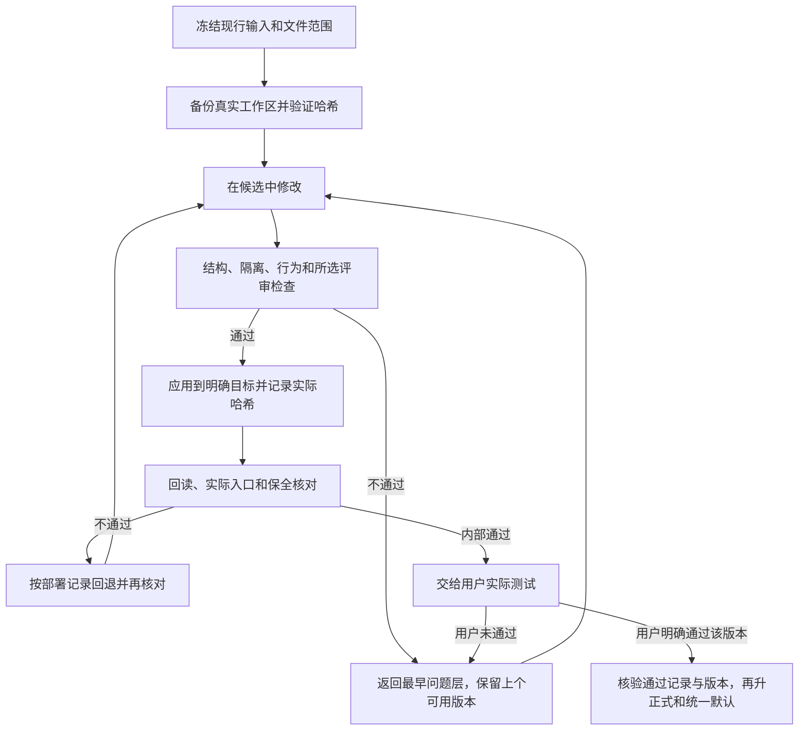

# 检查、候选应用和回退

两套方案共用同一创作核心。A由当前主模型设计和自检，程序只核对可确定的条件；B在相同材料上额外调用Jev做窄范围文字复核。安装普通技能不自动启用Jev，也不要求每次创作运行仓库维护测试。详见[语义检查](SEMANTIC_REVIEW.md)。



## 1. 备份

`scripts/skill_release.py` 只处理显式列出的普通文件，不扫描账号、密钥或整台电脑。配置示例：

```json
{"roots":[{"id":"runtime","root":"/absolute/skill-root","paths":["SKILL.md","references/contract.md"]}]}
```

```text
python -B scripts/skill_release.py snapshot --config roots.json --output-dir BACKUP --temp-dir TEMP
python -B scripts/skill_release.py verify --manifest BACKUP/manifest.json
```

备份保存实际文件字节，包括未提交改动，并记录每个文件及整个ZIP的哈希。输出目录与被管理文件必须互斥。临时目录由调用方明确指定，与目标在同卷；Windows不依赖系统默认临时盘。

## 2. 检查候选

```text
python -B scripts/check_skill_suite.py --profile A --temp-dir TEMP
python -B scripts/check_skill_suite.py --profile B --temp-dir TEMP --sample REVIEW_INPUT.json --allow-external
```

维护检查需要 `requirements-dev.txt` 中的精确依赖；普通文本技能运行不因此要求安装开发依赖。工具运行回归、便携性、独立包、文档、现有展示与页面检查；运行文件在检查期间变化则拒绝通过。B还需要安全注入的 `TYPESAFE_API_KEY` 和允许外发的实际文字样本。无密钥、接口失败或不确定结果不会被改写为B通过。

代码门不能检验电影感。维护者还应在独立上下文完成代表性真实文本任务，检查未改锁定项、环境持续、发现顺序、台词和局部修订。只有文字证据时报告文字层；真实视频和用户接受分别记录。

### 确定性构建A/B隔离测试包

在当前仓库运行以下入口，不再临时拼接ZIP。`OUTPUT`须为新目录或空目录，`TEMP`须是仓库外的独立现有临时目录；Windows二者均不得在C盘。外部输出还须明确提供外部输出开关。构建阶段只在TEMP中暂存，并在退出时清理；既有包即使带工具标记也不覆盖。

```text
python -B scripts/build_review_profiles.py --output OUTPUT --temp-dir TEMP --allow-external-output
```

两个ZIP都包含18项常规与3项实验Skill及逐包许可。A无Jev运行依赖；B只对分镜5.7.1增加可选Jev复核说明、原样复核脚本和根入口段落，标为5.7.1-jev，其余共同核心保持相同。PROFILE.json固定为candidate、用户测试pending、默认不联网且不默认启用；两个包有同一common_core_digest。分镜VERSION_MANIFEST.json与自身SHA记录实际字节，输出manifest.json及ZIP哈希用于冻结比对。

构建会拒绝链接、路径越界、非空输出以及检测到的私密文件或常见凭证格式；不能以扫描替代来源范围审查。精简运行包不包含依赖完整仓库测试资源的维护质量门。构建不安装、不切换默认、不晋升、不发布；用户准入仍执行下一节。

## 3. 用户测试与明确启用指令

### 常规用户验收

内部检查通过仅表示候选可以交给用户测试。A/B选择、开始工作、先试用、结构通过、模型评分、Jev通过或用户暂时未反馈，都不等于测试通过。

候选留在隔离目录，原默认保持。用户实际测试后明确认可对应版本，维护者才把真实用户原话、来源、对象和冻结包SHA记录到项目唯一状态的验收字段；不能要求用户填写内部表格。待修候选局部修改后重新测试，哈希变化则旧通过记录不能直接批准新包。用户通过一次具体版本测试即可按其批准范围升正式；“三次实战稳定”是另一种证据，不额外变成正式发布门槛。

正式切换前运行 `scripts/verify_user_acceptance.py --state PROJECT_STATE.json --profile A --artifact CANDIDATE.zip`。缺用户通过记录、对象不符或文件改变均拒绝。通过测试不自动授权外发或公开发布。

### 当前明确要求立即启用

用户在查看实际测试结果后，也可以明确要求立即采用某个版本。本轮维护者已要求发布成果并启用最新A5.7.1，沿用先前A选择；这是明确使用授权，不将21张首轮图或已知待修改写成审美通过。

这种情况使用独立的只读入口：

```text
python -B scripts/verify_activation_authorization.py --state PROJECT_STATE.json --profile A --version 5.7.1 --artifact FROZEN_ARTIFACT
```

它核对规范项目状态中的真实用户指令、先前选择来源、当前profile、version和冻结文件SHA，并复查读取期间是否发生变更。状态记录保留user_test_status；仅讨论、条件式要求、试用、否定、模型代批、对象或SHA不符都会拒绝。其结果只授权本机启用，不授予公开上传权限。原verify_user_acceptance.py仍只代表测试通过，两个入口不能互相冒充。

上传与页面编辑仍需用户另外明确授权。既有冻结包保留原始candidate元数据和字节，当前启用状态由精确对象的用户决定记录；不要重写旧包来制造测试通过。

## 4. 应用与记录

候选配置使用与baseline相同的root id，但root指向独立候选目录。只列要应用的文件；缺少候选文件不会被解释为删除。显式删旧使用 `delete:[{"root_id":"runtime","path":"old.md"}]`。

```text
python -B scripts/skill_release.py apply --manifest BACKUP/manifest.json --candidate-config CANDIDATE.json --output-dir DEPLOYMENT --temp-dir TEMP
```

默认预览。生产默认或正式源应用必须具备精确对象的用户测试通过记录，或通过上节独立核验的当前明确启用指令；只有隔离试用授权时仍不得改默认。对应权限成立后加 `--apply` 才执行。目标与基线不符则拒绝覆盖。中途失败会留下精确的 `apply_failed` 记录供恢复，不能声称部署成功。

如果维护者先备份、再直接编辑了工作区，使用 `capture` 如实登记已发生的修改：

```text
python -B scripts/skill_release.py capture --manifest BACKUP/manifest.json --config OBSERVED.json --output-dir DEPLOYMENT --temp-dir TEMP --apply
```

这里的 `--apply` 只保存恢复记录，不再修改管理文件。记录明确标为 `captured/observed_edits`，不伪称由应用工具执行。基线未列的新文件必须在配置的 `new_files` 中明确声明；这类新增由操作者确认，不能假称备份证明其以前不存在。

## 5. 回退与再次检查

```text
python -B scripts/skill_release.py restore --manifest BACKUP/manifest.json --deployment DEPLOYMENT/deployment.json --output-dir BEFORE_RESTORE --temp-dir TEMP
```

默认只预览；加 `--apply` 执行。工具先检查归档、记录绑定及当前文件是否仍等于实际部署哈希，再备份当前状态，随后恢复原文件。只移除记录中的、哈希仍匹配的明确新增文件；无关文件和目录保留。回退前的新快照和部署记录允许再次撤销回退。

发现外部修改、篡改备份、未知新增来源、路径越界或重解析点时拒绝，而非强行覆盖。恢复后重新跑适用检查及入口核对；失败的候选仍可在独立候选位置修订，不把它重新包装成已通过。

项目的 `PROJECT_STATE.json`、`CURRENT_STATE.md` 和工作台可以备份，但通用工具禁止直接覆盖它们。项目状态内容必须用现有 revision＋SHA 的比较交换恢复，再重新生成投影。维护记录不是另一份项目状态。

本轮本机启用另保留不新建ZIP的定点回退入口：从既有验证基线读取旧字节，按本次148文件部署记录逐项核对并恢复，状态通过原生revision与SHA比较交换更新。它与上面的通用restore不同；通用restore会额外创建快照，不适用于用户明确不要求新打包的这次回退。

## 6. 本轮验证口径

快照校验、真实文件恢复演练、代码测试、文字行为、真实服务调用、媒体和用户接受分开。原有展示图的接受状态继续保留，不自动给本轮技能整改或Jev追加接受。来源版本、读取量和一次试用时段可以记录；不能把文件变短、模拟服务通过或单次更快说成可靠提速或审美改善。
