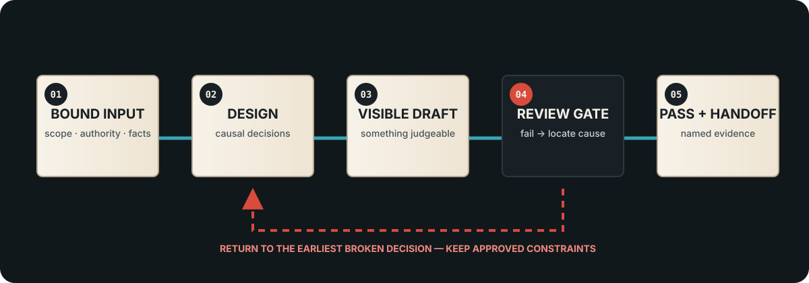

# How every Skill is designed

This repository is meant to be read on GitHub as well as installed in an Agent. You do not need to clone the repository to understand a module: open its human-readable design guide, then open its runtime `SKILL.md` when you want the exact operating instructions.

- [Browse every standalone design guide](skills/INDEX.md)
- [Choose by filmmaking task](../SKILL_CATALOG.md)
- [Understand installation and Agent hosts](INSTALLATION.md)

## The unit of design

One Skill owns one bounded outcome. It may work alone, or hand a named deliverable to a second Skill, but it does not silently take authority over another layer.

| Contract field | What it must answer |
|---|---|
| Purpose | What visible problem does this Skill solve? |
| Inputs | What must already be known, approved, or supplied? |
| Workflow | In what causal order does the work happen? |
| Return path | When a check fails, which earlier decision must be repaired? |
| Review gates | What must a reviewer inspect before accepting the output? |
| Pass standard | What observable evidence is enough to call the output complete? |
| Output | What can the next person or Agent actually use? |
| Boundary | What does this Skill deliberately refuse to decide or claim? |

This is why a Skill is more than a prompt collection. Its design includes failure handling, evidence, and a usable output contract.

## Shared operating loop



```text
request
  -> select one primary Skill
  -> verify required input and authority
  -> make the smallest visible draft that can be judged
  -> review module-specific gates
       -> fail: return to the earliest broken decision
       -> pass: record evidence and produce the named output
  -> hand off only when another Skill has a different, necessary contract
```

## Return design

“Try again” is not a return design. A useful return identifies the first failed assumption, keeps already approved constraints, and changes only the layer that caused the failure.

| Failure type | Return to | Preserve |
|---|---|---|
| Missing or contradictory input | Intake and scope | Nothing that depends on the missing fact |
| Story causality or character purpose fails | Story/directing analysis | Approved format, length, and production constraints |
| Blocking, camera, or continuity fails | Shot/asset design | Approved story beat and character intention |
| Style is decorative or physically incoherent | Visual-language design | Approved story, space, and action |
| Platform cannot execute the plan | Production/platform translation | Approved creative intent and continuity anchors |
| Evidence, rights, privacy, or authority is insufficient | Publication boundary | The private source; do not publish it while unresolved |
| Output exists but is not judgeable | Output contract | The work itself; change how it is exposed and verified |

The module guide for each Skill narrows this table to its own inputs and gates.

## Review and pass states

The repository keeps four facts separate:

1. **Structurally valid** — required files and local dependencies are present.
2. **Runnable or loadable** — a compatible Agent can discover or receive the instructions.
3. **Task-validated** — the Skill produced evidence on a real task.
4. **User-accepted** — a person reviewed the visible result and explicitly accepted it.

A lower state must never be reported as a higher one. Folder validation does not prove creative quality, and an output file does not prove user acceptance.

Every module-specific pass standard therefore uses observable nouns: a script passage, shot package, asset contract, research table, versioned semantic entry, qualified media file, or inspected interface. “Optimized,” “professional,” and “cinematic” are not evidence by themselves.

## Combining Skills without losing modularity

The complete studio route is:

```text
story -> assets -> visual language -> shots -> production -> validation
```

It is optional. A user may take only `character-asset`, only `noir-design`, only `director-agent`, or any other single module. When Skills are combined:

- one primary Skill remains responsible for the current deliverable;
- a handoff names the exact output the next Skill receives;
- the second Skill gets no hidden authority over the first Skill’s decisions;
- rejection returns to the responsible layer, not to the beginning of the whole pipeline;
- experimental modules remain opt-in and keep their experimental status.

## Reading a module on GitHub

Each page under [`docs/skills/`](skills/INDEX.md) contains the same eight-part contract, links to the exact runtime source, and states whether the module is packaged or experimental. That repeated structure is deliberate: readers can compare modules without learning a new page layout each time, while the content of every gate remains module-specific.

## Changing a Skill

A change is ready for review only when all of the following are true:

- the runtime instructions and the GitHub design guide still describe the same outcome;
- new dependencies are local to the standalone Skill folder;
- a failed check has a defined return point;
- the pass standard names observable evidence;
- repository validation passes;
- the release status does not overstate real-task or user acceptance.

See [Contributing](../CONTRIBUTING.md) for the submission workflow.
