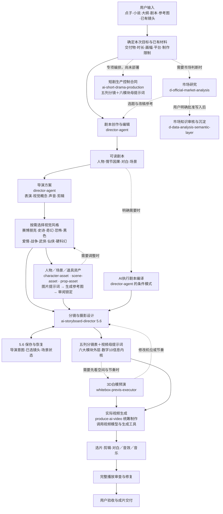

# 从输入到成片验收 / Complete filmmaking workflow

这里把每一步的输入、交付和返回关系放在一张图中。可以从已有剧本、参考图、导演方案或镜头继续，不必每次从头运行；只有当前交付需要时才进入下一层。

[下载完整 Mermaid 源图](assets/production-workflow.mmd) · [全部模块](../SKILL_CATALOG.md) · [当前源码安装](INSTALLATION.md#install-from-a-clone) · [14张用户接受成图及证据](showcase/manifest.json)

## 完整原图

下图保留当前5.6日常工作流的全部节点和返回线。它是职责和交接图，不表示所有步骤已自动执行，也不表示全部模块都在本仓库分发。

## 每个阶段实际交付什么

| 阶段 | 必要输入 | 可直接使用的交付 | 失败后返回 |
|---|---|---|---|
| 输入与范围 | 当前要求、已有材料、明确限制 | 本次结果、时长/画幅、成本和权限边界 | 决定结果的缺口 |
| 编剧与导演 | 点子、小说、大纲或已有剧本 | 可读剧本；人物行动、表演、视觉、声音、剪辑决定 | 最早断裂的因果或导演判断 |
| 视觉与资产 | 剧情和已有锁定 | 类型参数；人物/场景/道具提示词、实际参考图及审阅状态 | 不成立的构图、光影、材质、身份或空间 |
| 分镜与提示词 | 可用剧本、导演决定和所需资产 | 五列分镜＋一条完整母提示词；六模块外层、数字10信息内核 | 具体镜头、调度、时长或连续性问题 |
| 可选白模 | 已写好的提示词或镜头方案 | 可播放的3D机位与基础走位预演、编译合同、验证记录 | 编译解释或未通过的动作门 |
| 生成与后期 | 批准材料、实际可用模型和工具、所需授权 | 真实素材、选片、剪辑、对白、音效和音乐 | 失败镜头或后期环节 |
| 验收 | 最终渲染文件 | 完整播放检查、修复结果和用户决定 | 最早影响观看的实际缺陷 |

5.6在明确作品目录内保存导演意图、已选镜头、进入/退出状态和来源哈希，并恢复当前场所需知识。保存与恢复、明确几何检查、设计语义审阅、用户审美和真实视频效果分别验证。程序不自动评判好不好看，也不能强制所有聊天入口执行。

## 20项影视职责与1项网页辅助

计数口径：本仓库分发 **18项常规＋2项实验＝20个模块**，其中19项用于影视、1项用于网页。工作流另列外部仙侠技能，因此是 **20项影视职责＋1项网页辅助**；外部仙侠不计入本仓库20个模块、40份双语指南或ZIP。

| # | Skill | 职责与交付 | 分发/使用边界 |
|---|---|---|---|
| 1 | [director-agent](skills/zh-CN/director-agent.md) | 剧本创作、编辑、诊断；导演方案；明确需要时另编译AI执行剧本 | 常规；已有批准导演方案不重新导演 |
| 2 | [ai-storyboard-director](skills/zh-CN/ai-storyboard-director.md) | 5.6分镜、摄影设计、五列表、六模块母提示词、作品内保存与恢复 | 当前源码5.6；不等于旧Release ZIP已更新 |
| 3 | [character-asset](skills/zh-CN/character-asset.md) | 人物主参考、必要视图、身份和状态合同 | 按请求交提示词或实际图；用户审阅后锁定 |
| 4 | [scene-asset](skills/zh-CN/scene-asset.md) | 场景结构、空间锚点、光源与必要参考图 | 不因换机位重建场景 |
| 5 | [prop-asset](skills/zh-CN/prop-asset.md) | 道具结构、材质、比例和状态参考 | 单图不自动扩成多格；保留真实塑料、新物和设计发光 |
| 6 | [cyberpunk-design](skills/zh-CN/cyberpunk-design.md) | 技术与人的关系、功能光、空间层级 | 不强制雨夜、霓虹或湿地 |
| 7 | [epic-design](skills/zh-CN/epic-design.md) | 群体、地形、建筑和人物代价形成尺度 | 不只靠巨物和广角 |
| 8 | [fantasy-design](skills/zh-CN/fantasy-design.md) | 世界规则、魔法目标与环境反馈 | 奇幻效果仍有具体作用 |
| 9 | [horror-design](skills/zh-CN/horror-design.md) | 威胁、异常证据、显露与空间不安 | 不依靠死黑或血腥 |
| 10 | [noir-design](skills/zh-CN/noir-design.md) | 秘密、犯罪、关系压力和明暗信息 | 不等于黑白滤镜 |
| 11 | [romance-design](skills/zh-CN/romance-design.md) | 距离、视线、动作与关系变化 | 不强制粉色、暖光或拥抱 |
| 12 | [war-design](skills/zh-CN/war-design.md) | 地形、协同、负荷、行动与后果 | 不用装饰爆炸替代战争处境 |
| 13 | [wuxia-design](skills/zh-CN/wuxia-design.md) | 兵器、步法、支撑、接触与东方空间 | 静态交叉不证明动态攻防通过 |
| 14 | [hard-sci-fi-visual-director](skills/zh-CN/hard-sci-fi-visual-director.md) | 物理、功能、制造、环境及原创硬科幻视觉 | 本仓库实验包；有用户接受图例，未证明所有任务稳定 |
| 15 | [xianxia-visual-director](https://github.com/liyue-aigc/xianxia-visual-director) | 东方仙侠世界、天宫巨构与写实摄影 | 外部上游；无已核实再分发许可，不复制源码或打包 |
| 16 | [whitebox-previs-executor](skills/zh-CN/whitebox-previs-executor.md) | 提示词到可播放3D基础预演 | 实验包；人形和已实现代理，打斗必须逐动作过门 |
| 17 | [produce-ai-video](skills/zh-CN/produce-ai-video.md) | 统筹实际生成、选片、剪辑、声音、完整看片与修复 | 需要实际工具、模型与相应权限；不内置免费模型 |
| 18 | [ai-short-drama-production](skills/zh-CN/ai-short-drama-production.md) | 短剧节拍、资产、调度、光线、动作与QC控制合同 | 源码交付结构已对齐5.6；文本样本最终通过，未部署、实片待验证 |
| 19 | [d-official-market-analysis](skills/zh-CN/d-official-market-analysis.md) | 选题与平台研究、来源、数据、结论与独立待批准记录 | 按需研究；报告不授权知识写入 |
| 20 | [d-data-analysis-semantic-layer](skills/zh-CN/d-data-analysis-semantic-layer.md) | 用户批准后校验、版本化写入与回读 | 目标和批准来自当前任务；已存知识仍检查时效 |
| 辅助 | [web-design-director](skills/zh-CN/web-design-director.md) | 作品站、资产库、工作台和网页展示 | 只用于明确网页或应用界面任务；仓库README维护不触发建站 |

十种视觉路线＝八项常规类型＋实验硬科幻＋外部仙侠。选择取决于作品，不要求一次加载十项，也不把风格名变成统一色表或固定镜头。

## 证据与当前边界

本轮14张原创成图均已由用户接受，原幅展示及逐文件状态见[展示清单](showcase/manifest.json)。这证明这些图例的实际结果已被接受；没有旧版同题A/B，因此不把它们称为量化提升或所有题材的稳定成功率。完整视频仍须生成、完整播放、修复并单独验收。

当前源码的分镜入口为5.6；公开v1.3.0 Release是含5.4.4的旧快照；另行分发的5.6独立Preview有自己的标签和范围。更新源码、构建ZIP、推送Git和发布新Release是不同动作，见[安装说明](INSTALLATION.md)。
