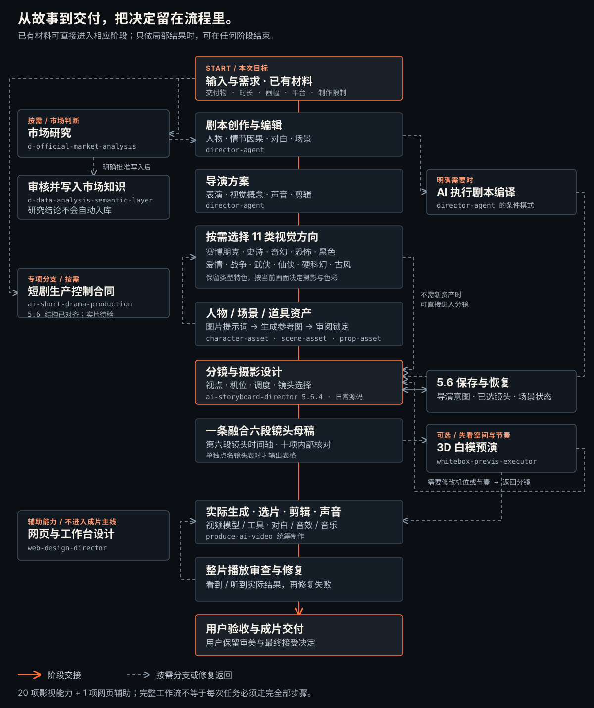

<div align="center">

# 开放影视技能｜Open Film Skills

**从点子与剧本，到导演、资产、镜头、提示词、视频和实际验收。**

[完整中文主页](../../../README.md) · [English](../../../README.md#english-overview) · [日本語](../ja/README.md) · [한국어](../ko/README.md)

</div>



[完整流程图、原始Mermaid和职责表](../../WORKFLOW.md) · [14张用户接受成图](../../../README.md#本轮14张用户接受成图) · [20模块目录](../../../SKILL_CATALOG.md) · [40份中英指南](../../skills/INDEX.md)

## 当前源码与发布快照

本仓库当前源码含 **18项常规＋2项实验＝20个独立模块**，对应40份英文/简体中文指南。20个模块中有19项影视技能和1项网页辅助；工作流另列外部仙侠，因此共20项影视职责＋1项网页辅助，外部项不计入源码包和指南数。

- 当前分镜源码为 **5.6**，已选择日常使用；明确作品目录时保存恢复导演意图、选中镜头与场景状态。
- [公开v1.3.0 Release](https://github.com/62656456/ai-film-skills/releases/tag/v1.3.0)仍是含 **5.4.4** 的历史快照，不因源码改变而更新。
- 另行标记的5.6独立Preview有自己的范围，不等于新完整套装Release。

本轮说明源码刷新，不声称已发布新Release。[安装版本选择](../../INSTALLATION.md)

## 按结果选入口

| 结果 | Skill |
|---|---|
| 可读剧本、对白修订或导演方案 | [director-agent](../../skills/zh-CN/director-agent.md) |
| 分镜、摄影设计和完整母提示词 | [ai-storyboard-director](../../skills/zh-CN/ai-storyboard-director.md) |
| 人物、场景和道具参考 | [character-asset](../../skills/zh-CN/character-asset.md)、[scene-asset](../../skills/zh-CN/scene-asset.md)、[prop-asset](../../skills/zh-CN/prop-asset.md) |
| 八种类型、硬科幻或仙侠方向 | [类型目录](../../../SKILL_CATALOG.md#genre-visual-language)、[硬科幻实验](../../skills/zh-CN/hard-sci-fi-visual-director.md)、[外部仙侠](https://github.com/liyue-aigc/xianxia-visual-director) |
| 生成前看3D机位与基础走位 | [whitebox-previs-executor](../../skills/zh-CN/whitebox-previs-executor.md)，实验包 |
| 实际生成、剪辑、声音和完整看片 | [produce-ai-video](../../skills/zh-CN/produce-ai-video.md) |
| 选题研究、批准后知识写入、网页工作台 | [完整目录](../../../SKILL_CATALOG.md#production-product-and-research) |

已有材料从对应阶段继续，不要求每次重做全流程。短剧控制器已封装但未部署，作为专项编排使用前需对齐当前5.6交接。

## 安装当前检出的源码

```bash
git clone https://github.com/62656456/ai-film-skills.git
cd ai-film-skills
git log -1 --oneline
python scripts/install_skill.py --list
python scripts/install_skill.py ai-storyboard-director --platform codex
```

安装前检查所选分支/提交与Skill版本。未推送本地更新不会自动出现在公共默认分支。其他宿主、历史ZIP、实验包主动安装及覆盖边界见[安装指南](../../INSTALLATION.md)和[兼容说明](../../COMPATIBILITY.md)。完整文件夹可读不等于每个宿主已原生加载或实际运行。

## 实际成果与方法边界

本轮14张原创图均经用户接受，包括8类型、5张硬科幻和1张仙侠；主页按原比例展示并提供原始PNG，[清单](../../showcase/manifest.json)保留逐图证据。没有旧版同题A/B，不声称量化提升或全题材稳定。

新增画面关系方法先看观看重点，再设计明暗、色彩、材质与空间。它不把暖光、浅景深、霓虹、磨损或前景人物当通用要求；二维动画、三维动画与摄影写实分别选择负向。单图请求不自动变多格，只有文本时不假称像素验收。

白模只证明已实现代理和已过动作门的预演解释，不证明任意完整打斗或视频模型将生成相同画面。5.6记录程序不评审美。最终视频仍需实际生成、完整播放、修复和用户验收。

## 来源与许可

外部仙侠只列[上游链接](https://github.com/liyue-aigc/xianxia-visual-director)，没有已核实再分发许可，因此不复制源码或进入ZIP。本仓库原创内容按[Apache License 2.0](../../../LICENSE)分发；参考媒体和私人项目不随包发布。

[审核总则](../../SKILL_DESIGN_SYSTEM.md) · [分发范围](../../../PUBLICATION_SCOPE.md) · [反馈](https://github.com/62656456/ai-film-skills/issues)
