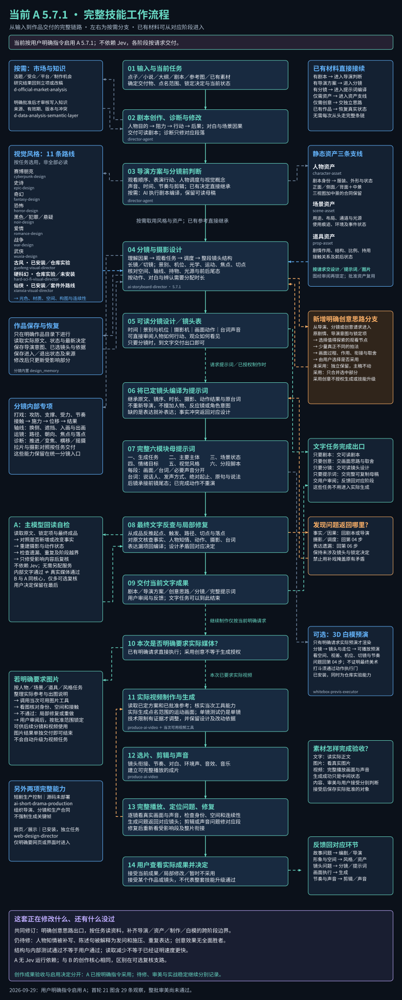

<div align="center">

# 开放影视技能｜Open Film Skills

**从故事、导演与资产，到具体镜头、生成提示词和实际制作。**

[完整中文主页](../../../README.md) · [English](../../../README.md#english-overview) · [日本語](../ja/README.md) · [한국어](../ko/README.md)

</div>

## 1. 技能介绍与完整工作流程

这套技能把影视创作分成能直接使用的结果：剧本与对白、导演方案、人物场景道具、视觉方向、分镜摄影、提示词、按需预演、实际生成与完整看片。点子、小说、剧本、图片和已定镜头都能作为输入；已有成果从对应阶段继续。

当前源码包含 **18项常规＋3项实验＝21个独立模块**，配有42份中英指南。工作流另列外部仙侠，合计21项影视职责＋1项网页辅助；外部入口不增加源码包数量。



[完整工作流与方案关系](../../research/skill-overhaul/workflows/index.md) · [三套流程并排总图](../../research/skill-overhaul/workflows/compare-all.svg) · [逐节点职责](../../WORKFLOW.md)

创意思路、可读分镜、视频提示词与实际媒体分别交付。采用创意后才并入主方案；查看分镜不自动授权实际生成，最终视频需要完整播放、修复和用户验收。

## 2. 功能、实现目的与实际成果

| 要完成的事 | 直接入口 |
|---|---|
| 写剧本、改对白、梳理人物行动和导演方案 | [director-agent](../../skills/zh-CN/director-agent.md) |
| 设计人物、场景、道具与可复用状态 | [人物](../../skills/zh-CN/character-asset.md) · [场景](../../skills/zh-CN/scene-asset.md) · [道具](../../skills/zh-CN/prop-asset.md) |
| 设计观看顺序、摄影调度和完整提示词 | [分镜与摄影](../../skills/zh-CN/ai-storyboard-director.md) |
| 按题材设计光色、材料、尺度与构图 | [全部类型](../../../SKILL_CATALOG.md#genre-visual-language) · [硬科幻实验](../../skills/zh-CN/hard-sci-fi-visual-director.md) · [外部仙侠](https://github.com/liyue-aigc/xianxia-visual-director) |
| 生成前查看3D机位、视差与基础走位 | [白模实验包](../../skills/zh-CN/whitebox-previs-executor.md) |
| 组织真实生成、剪辑、声音与看片返修 | [produce-ai-video](../../skills/zh-CN/produce-ai-video.md) |
| 市场研究、批准后知识写入、网页创作工具 | [完整21技能目录](../../../SKILL_CATALOG.md) |

[查看全部21个独立技能及用途](../../../README.md#全部21个独立技能) · [42份中英指南](../../skills/INDEX.md)

### 七题材三版：21张首轮分镜测试图

七个新故事分别设计30秒分镜，得到21套方案、149镜和21张实际图片。测试时默认5.6.5、A5.7.1、B5.7.1-jev的原稿、图像、生成说明和逐图问题全部保留。

| 测试时默认5.6.5 | A5.7.1 | B5.7.1-jev |
|---|---|---|
| [](../../research/skill-overhaul/seven-genres/images/01-suspense-current.png) | [](../../research/skill-overhaul/seven-genres/images/01-suspense-a.png) | [](../../research/skill-overhaul/seven-genres/images/01-suspense-b.png) |

[按题材切换高清三版](../../research/skill-overhaul/seven-genres/viewer.html) · [七题材全部21图与审查报告](../../research/skill-overhaul/seven-genres/index.md)

**这批尚未获整批审美通过。** 15张包含明确或限定范围的待修观察，共29条；其余6张本轮未发现可确认硬冲突，也不视作通过。A/B共享创作核心，B只增加可选文字核对；Jev没有直接检查这些图片像素。图像模型造成的偏差、文本设计和技能版本能力分别判断。

### 同题融合与既有研究


[旧版、A、修订和融合过程](../../research/skill-overhaul/fusion/index.md) · [全部整改研究](../../research/skill-overhaul/index.md)

此前的[21张已接受作品](../../../README.md#本轮21张用户接受视觉成果)包含19张原创静帧和2张LUMEN界面截图，与本次21张分镜测试是不同批次。原接受范围和原始PNG继续可查。另保留[26张视觉研究候选](../../research/visual/index.md)、[白模与实际生成对照](../../research/whitebox/index.md)和[研究结论](../../RESEARCH.md)，不把有限预演写成任意完整打斗或最终AI成片。

### 安装与使用

```bash
git clone https://github.com/62656456/ai-film-skills.git
cd ai-film-skills
git log -1 --oneline
python scripts/install_skill.py --list
python scripts/install_skill.py ai-storyboard-director --platform codex
```

安装前核对分支、提交与Skill版本。先请求可读分镜；要提示词时，再明确编译同一方案；实际生图、视频与预演按任务单独授权。

[完整安装方式](../../INSTALLATION.md) · [宿主兼容边界](../../COMPATIBILITY.md) · [源码与公开范围](../../../PUBLICATION_SCOPE.md) · [许可](../../../LICENSE)

外部仙侠只链接上游，没有已核实再分发许可时不复制源码。文件存在、内部检查、真实执行和用户接受分别记录。

## 3. 版本更新内容

### 2026-09-29：A5.7.1明确启用

依据用户本轮直接、明确的启用授权，**A5.7.1设为默认方案，B5.7.1-jev保留为可选文字复核方案**。启用属于使用决定，不代表新21张测试图审美通过，已知29条观察仍公开保留。

本次更新重点是创意思路独立交付、分镜与提示词按阶段衔接、保留已有导演决定、取消预定镜数和类型固定切片，并公开工作流、融合过程和逐图问题。[完整更新与测试资料](../../research/skill-overhaul/index.md)

| 版本入口 | 范围 |
|---|---|
| [当前源码A5.7.1](../../../skills/ai-storyboard-director/SKILL.md) | 默认方案；本轮明确授权启用，审美验收与已知待修另列 |
| B5.7.1-jev | 同一创作核心，可选Jev文字核对，不代替看图 |
| 测试图中的5.6.5 | 实验开始时的默认版本，保留历史标签和原始输出 |
| [v1.3.0 Release](https://github.com/62656456/ai-film-skills/releases/tag/v1.3.0) | 含5.4.4的旧发布快照，不随源码变化重写 |
| 5.6独立Preview | 独立预览范围，见[安装版本说明](../../INSTALLATION.md)，不等同于当前源码或新完整Release |

源码更新与创建Release分别进行。内部21包结构核对、质量门、文本试用和回归记录按原执行范围公开，不能据此宣称整套技能实战稳定。[检查方式](../../SEMANTIC_REVIEW.md) · [部署与回退](../../RELEASE_WORKFLOW.md)
