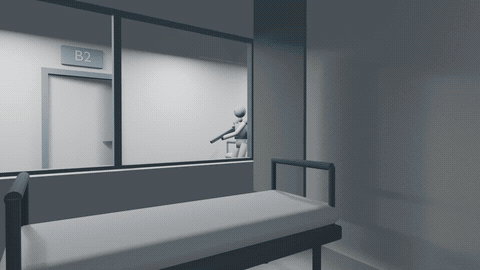
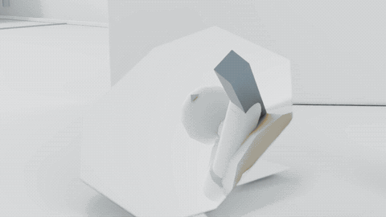
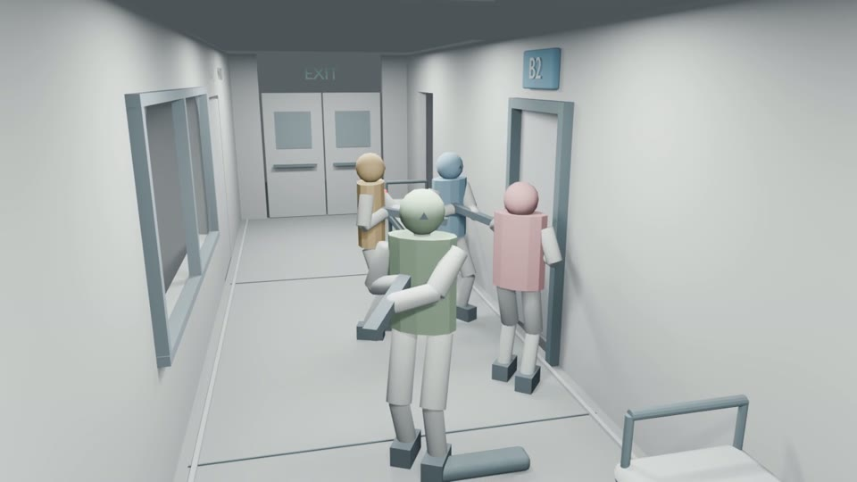
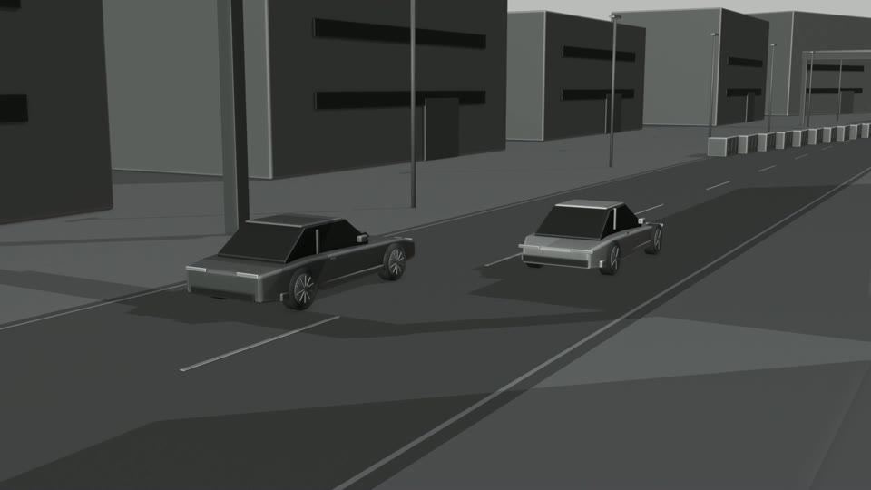
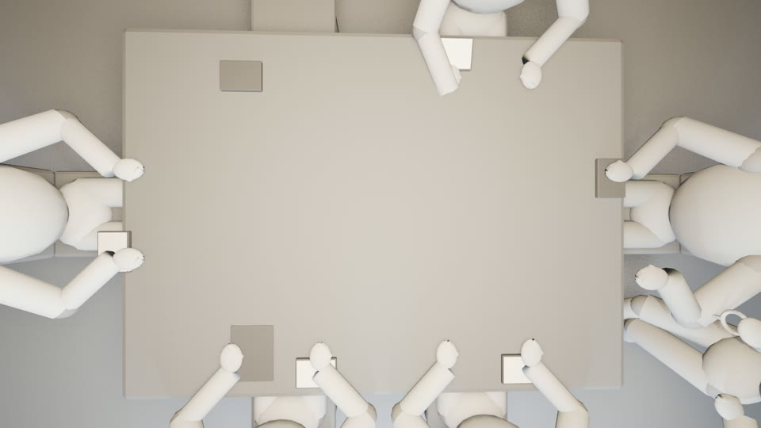
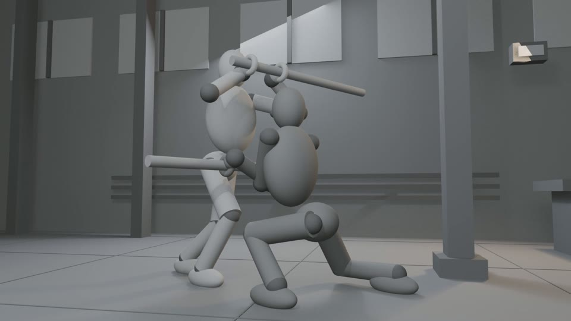
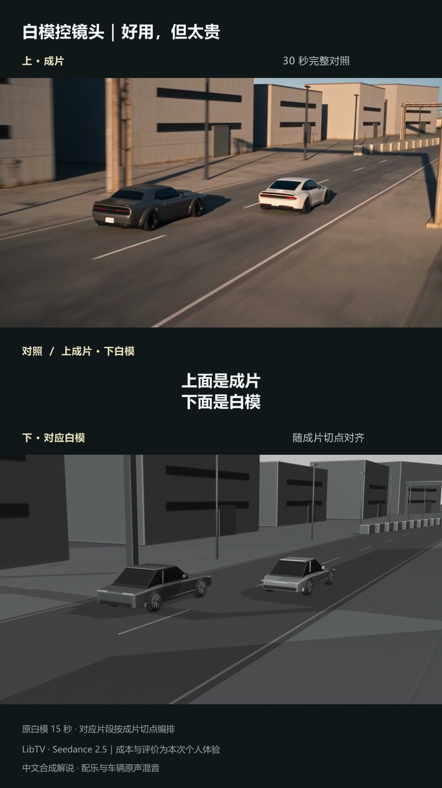

# 3D 白模研究：先看空间、动作与摄影如何发生

这里集中展示 **7 条完整视频、2 条完整时长动画预览、3 份可编辑工程，以及三组外观参考图和实际提示词**。最新实验来自 2026 年 9 月 18—19 日；此前的追逐、博弈、棍术和生成对照也保留，方便看见研究如何推进。

当前可确认的是：这些设计已经变成可播放、可检查的三维预演。动作审美、正式视频模型的复现能力和成本收益，需要另外验证。最新三条作为历史研究案例公开，不恢复原项目的剧本或生产状态。

## 先看最新两项

### 1. 连续运镜中的动作重排 · 30 秒 · 9 月 19 日

[完整高清 MP4](action-reblock-30s.mp4) · [可编辑 Blender 工程](action-reblock-30s.blend) · [静态封面](action-reblock-30s.jpg) · [工程清理核验](action-reblock-30s.verification.json)

摄影机从房间穿过窗洞，接近走廊里的队伍，再随着人物转身、手势和重新展开改变位置。返工重点是把脚步支撑、抬脚、收步、头胸转向和握持放在实际动作时间里；之前整体放慢旧动作的做法被放弃。

**研究候选，未获审美通过。** 人物由刚性关节代理组成，使用两段肢体求解；工程没有 Armature 骨架。这可以检查走位和取景，但还不能代表可信的真人表演或完整角色动画。

### 2. 用极简人物检查分镜 · 30 秒 / 11 镜 · 9 月 18 日

[完整高清 MP4](minimal-shots-30s.mp4) · [可编辑 Blender 工程](minimal-shots-30s.blend) · [静态封面](minimal-shots-30s.jpg) · [工程清理核验](minimal-shots-30s.verification.json)

人物简化成球头、柱身、必要四肢和道具杆，保留入口、走廊、门窗和床位。观察不同景别如何交代队伍、视线方向、前后距离、门后的未知空间，以及切镜前后的位置关系。

**历史研究候选，未获审美通过。** 它保留原先的动作和摄影设计，用来判断最低模型精度是否足以读懂分镜；不能据此评价最终服装、人物外貌、材质或表演。

两条动画均覆盖原片完整 30 秒，以 480 像素宽、5fps 便于浏览；未裁掉中段或改变速度。完整 MP4 均为 1280×720、24fps、720 帧、无声。

## 失败如何带来下一次修改

### 3. 连续复杂运镜初版 · 20 秒 · 9 月 18 日

[观看完整 MP4](complex-camera-20s.mp4) · [可编辑 Blender 工程](complex-camera-20s.blend) · [工程清理核验](complex-camera-20s.verification.json)

这条实验验证了穿窗、接近、转向、升高后撤的连续机位。它把原有约 13 秒走位整体放慢到 20 秒，摄影路径可以运行，人物动作却没有因此变得准确；**动作质量被用户否定，随后进入上面的 30 秒重排实验**。

公开它是为了保留可比较的失败过程。路径净空和解码成功，不能替代动作可读性；同样，把时间拉长不等于把动作设计完整。规格为 1280×720、24fps、480 帧、无声。

## 已公开的三组电影镜头案例

这些案例首次制作于 9 月 9 日，并于 9 月 10 日在 [AI Visual Previs Lab](https://github.com/62656456/ai-visual-previs-lab) 公开。本页保留完整原片及实际提示词。每组一张参考图负责外观，白模负责空间、运动与摄影；这种数量分工属于本次测试，不是所有项目的统一限制。

### 4. 高速追击 · 15 秒 / 6 镜

[完整白模](chase/whitebox.mp4) · [唯一外观参考图](chase/reference.png) · [完整母提示词](chase/prompt.md)

逼近、抢位、窄口退让、贴地通过、弯道接力、尾部威胁，在同一条道路关系里展开。重点是车辆相对距离、机位、切点和速度感，而不是车辆材质完成度。

### 5. 权力博弈 · 30 秒 / 8 镜

[完整白模](power/whitebox.mp4) · [唯一外观参考图](power/reference.png) · [完整母提示词](power/prompt.md)

六人固定座位，翻票、四比二结果、钥匙交割与新命令执行。研究对象是关系如何通过站位、视线、关键道具交接和取景改变，而非用对白解释所有权力变化。

### 6. 棍术交锋 · 15 秒 / 7 镜

[完整白模](fight/whitebox.mp4) · [唯一外观参考图](fight/reference.png) · [完整母提示词](fight/prompt.md)

格挡、滑移卸力、触柱、短端反击、下潜、肩胸施力与落膝，重点检查谁主动、在哪里接触、如何反作用、下一步为什么发生。固定案例能重放，不代表任意打斗提示词已经自动化，也不代表用户审美通过。

三条原片均为 1920×1080、24fps。需要重放场景的人可以访问已公开的 [固定案例执行器与源码](https://github.com/62656456/ai-visual-previs-lab/tree/main/experimental/whitebox-previs-executor)。

## 白模进入视频模型之后

### 7. 赛车生成片与白模对照 · 完整保留 721 帧

[配音配乐讲解版](chase-comparison/comparison-v2.mp4) · [完整原生成片](chase-comparison/generated-full.mp4) · [逐段对应说明](chase-comparison/README.md) · [帧映射](chase-comparison/mapping.json)

原白模 15 秒，实际生成时误选了约 30 秒。生成片 **12.5—27.375 秒没有对应的白模镜头**；对照在此段显示未覆盖说明，并保持最后一帧参考，不用循环、剪掉失配段或整段慢放制造忠实对应。

创作者这次反馈是镜头控制有效、更稳，但参考生成成本高，更倾向先用提示词设计普通镜头。这是一次真实体验，受到时长不同等因素影响，不能推导成功率、统一价格或普遍成本优势。讲解版含公共库音色和目录配乐，音轨不单独分发，详见 [媒体许可范围](MEDIA_LICENSE.md)。

## 这批实验带来的判断

| 问题 | 从已发生的实验得到的判断 | 下一步验证 |
|---|---|---|
| 复杂摄影能否只靠文字检查？ | 三维预演能把遮挡、净空、站位与切点显形，便于发现问题。 | 在正式生成中逐项检查这些约束是否保留。 |
| 数值通过是否意味着动作成立？ | 20 秒初版表明，路径和媒体正常仍可能动作失败。 | 先看支撑、接触、转向和反作用，再扩展长段。 |
| 需要多精细的人物？ | 极简代理足够检查部分空间与镜头关系；真实表演仍超出它的范围。 | 比较关节代理、真正骨架和真实视频对同一动作的表达。 |
| 白模参考是否值得增加成本？ | 已有一次生成对照和个人反馈，尚无可归因的统计结果。 | 同内容、同外观图、同时长、同模型设置，重复比较有无白模的可用秒数、空间错误、重试和支出。 |

## 文件、核验与使用边界

[媒体清单](media-manifest.json)记录文件大小、SHA256、实际规格、研究角色和本次核验范围。八个 MP4 文件对应上面的七项展示及一份保留原生成结果的支持材料；两条 GIF 都是完整时长浏览副本。

本次做了文件一致性检查、媒体计帧与全片解码、选定画面的视觉检查。最新三份 Blender 工程在关闭脚本执行的环境中打开，移除内嵌文字块，统一相对渲染路径后另存；公开副本重新打开并比较四个时间点的物体矩阵、网格顶点与摄影参数，均保持一致。三个工程无外部资源依赖、无驱动器，**均不是 Armature 角色骨架**。使用 Blender 5.2.1 LTS 保存；其他版本兼容性未实测。

这些检查不等于连续实时观看、用户审美接受、跨模型测试或严格 A/B。公开历史研究也不恢复原项目的生产状态。媒体、提示词、代码和第三方音轨的适用范围见 [MEDIA_LICENSE.md](MEDIA_LICENSE.md)。
